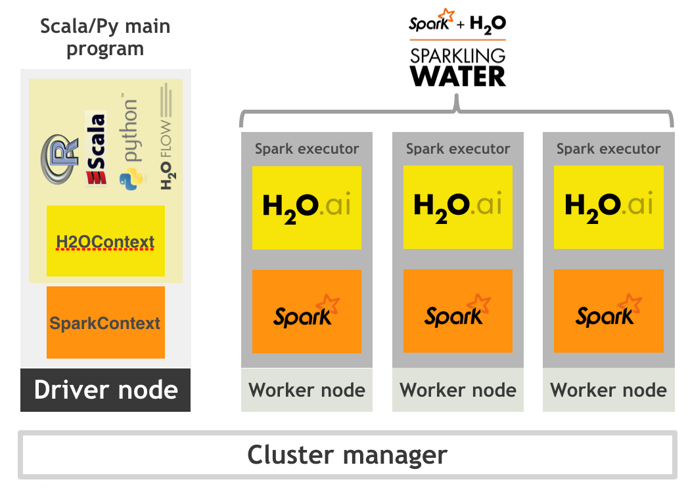

# Sparkling Water Development Documentation

##Table of Contents
- [Typical Use Case](#UseCase)
- [Requirements](#Req)
- [Design](#Design)
- [Features](#Features)
  - [Supported Data Sources](#DataSource)
  - [Supported Data Formats](#DataFormat)
  - [Data Sharing](#DataShare)
  - [Provided Primitives](#ProvPrim)
- [Running on Select Target Platforms](#TargetPlatforms)
  - [Local](#Local)
  - [Standalone](#Standalone)
  - [YARN](#YARN)
  - [Mesos](#Mesos)
- [H2O Initialization Sequence](#H2OInit)
  - [Configuration](#Config)
    - [Build Environment](#BuildEnv)
    - [Run Environment](#RunEnv)
    - [Sparkling Water Configuration Properties](#Properties)
- [Running Sparkling Water](#RunSW)
  - [Starting H2O Services](#StartH2O)
  - [Memory Allocation](#MemorySetup)
  - [Converting H2OFrame into RDD](#ConvertDF)
    - [Example](#Example)
  - [Converting H2OFrame into DataFrame](#ConvertSchema)
    - [Example](#Example2)
  - [Converting RDD into H2OFrame](#ConvertRDD)
    - [Example](#Example3)
  - [Converting DataFrame into H2OFrame](#ConvertSchematoDF)
    - [Example](#Example4)
  - [Creating H2OFrame from an existing key](#CreateDF)
  - [Calling H2O Algorithms](#CallAlgos)
  - [Running Unit Tests](#UnitTest)
- [Integration Tests](#IntegTest)
  - [Testing Environment](#TestEnv)
  - [Testing Scenarios](#TestCases)
  - [Integration Tests Example](#IntegExample)
- [Troubleshooting and Log Locations](#Logging)
- [Sparkling Shell Console Output](#log4j)
- [Sparkling Water Tuning](#SparklingWaterTuning) 

--- 
 
 <a name="UseCase"></a>
## Typical Use-Case
Sparkling Water excels in leveraging existing Spark-based workflows that need to call advanced machine learning algorithms. A typical example involves data munging with help of Spark API, where a prepared table is passed to the H2O DeepLearning algorithm. The constructed DeepLearning model estimates different metrics based on the testing data, which can be used in the rest of the Spark workflow.

---

<a name="Req"></a>
## Requirements
 - Linux or Mac OSX platform
 - Java 1.7+
 - [Spark 1.3.0+](http://spark.apache.org/downloads.html)

---

<a name="Design"></a>
## Design

Sparkling Water is designed to be executed as a regular Spark application.
It provides a way to initialize H2O services on each node in the Spark cluster and access
data stored in data structures of Spark and H2O.

Since Sparkling Water is designed as Spark application, it is launched 
inside a Spark executor, which is created after application submission. 
At this point, H2O starts services, including distributed KV store and memory manager,
and orchestrates them into a cloud. The topology of the created cloud matches the topology of the underlying Spark cluster exactly.

 

When H2O services are running, it is possible to create H2O data structures, call H2O algorithms, and transfer values from/to RDD.

---

<a name="Features"></a>
## Features

Sparkling Water provides transparent integration for the H2O engine and its machine learning 
algorithms into the Spark platform, enabling:
 * use of H2O algorithms in Spark workflow
 * transformation between H2O and Spark data structures
 * use of Spark RDDs as input for H2O algorithms
 * transparent execution of Sparkling Water applications on top of Spark


<a name="DataSource"></a> 
### Supported Data Sources
Currently, Sparkling Water can use the following data source types:
 - standard RDD API to load data and transform them into `H2OFrame`
 - H2O API to load data directly into `H2OFrame` from:
   - local file(s)
   - HDFS file(s)
   - S3 file(s)

---
<a name="DataFormat"></a>   
### Supported Data Formats
Sparkling Water can read data stored in the following formats:

 - CSV
 - SVMLight
 - ARFF


---
<a name="DataShare"></a>
### Data Sharing
Sparkling Water enables transformation between different types of Spark `RDD` and H2O's `H2OFrame`, and vice versa.

 

When converting from `H2OFrame` to `RDD`, a wrapper is created around the `H2OFrame` to provide an RDD-like API. In this case, no data is duplicated; instead, the data is served directly from then underlying `H2OFrame`.

Converting in the opposite direction (i.e, from Spark `RDD`/`DataFrame` to `H2OFrame`) needs evaluation of data stored in Spark `RDD` and transfer them from RDD storage into `H2OFrame`. However, data stored in `H2OFrame` is heavily compressed. 

<!--TODO: estimation of overhead -->
----
<a name="ProvPrim"></a>
### Provided Primitives
The Sparkling Water provides following primitives, which are the basic classes used by Spark components:


| Concept        | Implementation class              | Description |
|----------------|-----------------------------------|-------------|
| H2O context    | `org.apache.spark.h2o.H2OContext` | H2O context that holds H2O state and provides primitives to transfer RDD into H2OFrame and vice versa. It follows design principles of Spark primitives such as `SparkContext` or `SQLContext` |
| H2O entry point| `water.H2O`                       | Represents the entry point for accessing H2O services. It holds information about the actual H2O cluster, including a list of nodes and the status of distributed K/V datastore. |
| H2O H2OFrame  | `water.fvec.H2OFrame`            | H2OFrame is the H2O data structure that represents a table of values. The table is column-based and provides column and row accessors. |
| H2O Algorithms | package `hex`                     | Represents the H2O machine learning algorithms library, including DeepLearning, GBM, RandomForest. |
 

---

<a name="TargetPlatforms"></a>
# Running on Select Target Platforms

Sparkling Water can run on top of Spark in the various ways described in the following sections.

If the Sparkling Water application is submitted using `./spark-submit` script, it is necessary to set `spark.repl.class.uri` configuration property with the `H2OInterpreter.classServerUri` inside the application code. So for example, the spark config would look like:

```
val conf: SparkConf = new SparkConf().setAppName("Sparkling Water Application").set("spark.repl.class.uri",H2OInterpreter.classServerUri)
```

This step does not have to be done when starting Sparkling Water using `./sparkling-shell` script.
<a name="Local"></a>
## Local
In this case Sparkling Water runs as a local cluster (Spark master variable points to one of values `local`, `local[*]`, or `local-cluster[...]`

<a name="Standalone"></a>
## Standalone
[Spark documentation - running Standalone cluster](http://spark.apache.org/docs/latest/spark-standalone.html)

<a name="YARN"></a>
## YARN
[Spark documentation - running Spark Application on YARN](http://spark.apache.org/docs/latest/running-on-yarn.html)

When submitting Sparkling Water application to CHD or Apache Hadoop cluster, the command to submit may look like:
```
./spark-submit --master=yarn-client --class water.SparklingWaterDriver --conf "spark.yarn.am.extraJavaOptions=-XX:MaxPermSize=384m -Dhdp.version=current"
--driver-memory=8G --num-executors=3 --executor-memory=3G --conf "spark.executor.extraClassPath=-XX:MaxPermSize=384m -Dhdp.version=current"
sparkling-water-assembly-1.4.11-all.jar
```

When submitting sparkling water application to HDP Cluster, the command to submit may look like:
```
./spark-submit --master=yarn-client --class water.SparklingWaterDriver --conf "spark.yarn.am.extraJavaOptions=-XX:MaxPermSize=384m -Dhdp.version=current"
--driver-memory=8G --num-executors=3 --executor-memory=3G --conf "spark.executor.extraClassPath=-XX:MaxPermSize=384m -Dhdp.version=current"
sparkling-water-assembly-1.4.11-all.jar
```
Apart from the typical spark configuration it is necessary to add `-XX:MaxPermSize=384m` (or higher, but 384m is minimum) to both `spark.executor.extraClassPath` and `spark.yarn.am.extraJavaOptions` (or for client mode, `spark.driver.extraJavaOptions` for cluster mode) configuration properties in order to run Sparkling Water correctly.

The only difference between HDP cluster and both CDH and Apache hadoop clusters is that we need to add `-Dhdp.version=current` to both `spark.executor.extraClassPath` and `spark.yarn.am.extraJavaOptions` (resp., `spark.driver.extraJavaOptions`) configuration properties in the HDP case.

<a name="Mesos"></a>
## Mesos
[Spark documentation - running Spark Application on Mesos](http://spark.apache.org/docs/latest/running-on-mesos.html)


---
<a name="H2OInit"></a>
# H2O Initialization Sequence
If `SparkContext` is available, initialize and start H2O context: 
```scala
val sc:SparkContext = ...
val hc = H2OContext.getOrCreate(sc)
```

or:
```scala
val sc:SparkContext = ...
val hc = new H2OContext(sc).start()
```

The call will:
 1. Collect the number and host names of the executors (worker nodes) in the Spark cluster
 2. Launch H2O services on each detected executor
 3. Create a cloud for H2O services based on the list of executors
 4. Verify the H2O cloud status

The former variant is preferred, because it initiates and starts H2O Context in one call and also can be used to obtain already existing H2OContext, but it does semantically the same as the latter variant.

---
<a name="Config"></a>
## Configuration

<a name="BuildEnv"></a>
### Build Environment
The environment must contain the property `SPARK_HOME` that points to the Spark distribution.

---

<a name="RunEnv"></a>
### Run Environment
The environment must contain the property `SPARK_HOME` that points to the Spark distribution.

---

<a name="Properties"></a>
### Sparkling Water Configuration Properties

The following configuration properties can be passed to Spark to configure Sparking Water:

| Property name | Default value | Description |
|---------------|---------------|-------------|
| **Generic parameters** |||
|`spark.ext.h2o.flatfile` | `true`| Use flatfile (instead of multicast) approach for creating H2O cloud |
|`spark.ext.h2o.cluster.size` | `-1` |Expected number of workers of H2O cloud. Use -1 to automatically detect the cluster size. This number must be equal to number of Spark workers.|
|`spark.ext.h2o.port.base`| `54321`| Base port used for individual H2O node configuration.|
|`spark.ext.h2o.port.incr`| `2` | Increment added to base port to find the next available port.|
|`spark.ext.h2o.cloud.timeout`| `60*1000` | Timeout (in msec) for cloud  |
|`spark.ext.h2o.spreadrdd.retries` | `10` | Number of retries for creation of an RDD covering all existing Spark executors. |
|`spark.ext.h2o.cloud.name`| `sparkling-water-` | Name of H2O cloud. |
|`spark.ext.h2o.network.mask`|--|Subnet selector for H2O if IP detection fails - useful for detecting the correct IP if 'spark.ext.h2o.flatfile' is false. |
|`spark.ext.h2o.nthreads`|`-1`|Limit for number of threads used by H2O, default `-1` means unlimited.|
|`spark.ext.h2o.disable.ga`|`false`|Disable Google Analytics tracking for embedded H2O.|
|`spark.ext.h2o.subseq.tries`|`5`|Subsequent successful tries to figure out size of Spark cluster which are producing the same number of nodes.|
| **H2O server node parameters** |||
|`spark.ext.h2o.node.log.level`| `INFO`| H2O internal log level used for launched H2O nodes. |
|`spark.ext.h2o.node.log.dir`| ` System.getProperty("user.dir") + File.separator + "h2ologs"` or YARN container dir| Location of h2o logs on executor machine. |
| **H2O client parameters** |||
|`spark.ext.h2o.client.log.level`| `INFO`| H2O internal log level used for H2O client running inside Spark driver. |
|`spark.ext.h2o.client.log.dir`| ` System.getProperty("user.dir") + File.separator + "h2ologs"`| Location of h2o logs on driver machine. |
|`spark.ext.h2o.client.web.port`|`-1`|Exact client port to access web UI. The value `-1` means automatic search for free port starting at `spark.ext.h2o.port.base`.|
|`spark.ext.scala.int.default.num`|`1`|Number of executors started at the start of h2o services.|
|`spark.ext.h2o.repl.enabled`|`true`|Decides whether H2O repl is initialized or not. The repl is initialized by default.|
|`spark.ext.h2o.topology.change.listener.enabled`|`true`|Decides whether listener which kills h2o cloud on the change of underlying cluster's topology is enabled or not.|

---

<a name="RunSW"></a>
# Running Sparkling Water

---

<a name="StartH2O"></a>
### Starting H2O Services
```scala
val sc:SparkContext = ...
val hc = H2OContext.getOrCreate(sc)
```

or:
```scala
val sc:SparkContext = ...
val hc = new H2OContext(sc).start()
```

When the number of Spark nodes is known, it can be specified in `getOrCreate` call:
```scala
val hc = H2OContext.getOrCreate(sc, numOfSparkNodes)
```

or in `start` method of H2O Context:
```scala
val hc = new H2OContext(sc).start(numOfSparkNodes)
```

The former variant is preferred, because it initiates and starts H2O Context in one call and also can be used to obtain already existing H2OContext, but it does semantically the same as the latter variant.

---
<a name="MemorySetup"></a>
### Memory Allocation 

H2O resides in the same executor JVM as Spark. The memory provided for H2O is configured via Spark; refer to [Spark configuration](http://spark.apache.org/docs/1.4.0/configuration.html) for more details.

#### Generic configuration
 * Configure the Executor memory (i.e., memory available for H2O) via the Spark configuration property `spark.executor.memory` .
     > For example, `bin/sparkling-shell --conf spark.executor.memory=5g` or configure the property in `$SPARK_HOME/conf/spark-defaults.conf`
     
 * Configure the Driver memory (i.e., memory available for H2O client running inside Spark driver) via the Spark configuration property `spark.driver.memory`
     > For example, `bin/sparkling-shell --conf spark.driver.memory=4g` or configure the property in `$SPARK_HOME/conf/spark-defaults.conf`
      
#### Yarn specific configuration
* Refer to the [Spark documentation](http://spark.apache.org/docs/1.4.0/running-on-yarn.html)

* For JVMs that require a large amount of memory, we strongly recommend configuring the maximum amount of memory available for individual mappers. For information on how to do this using Yarn, refer to http://docs.h2o.ai/deployment/hadoop_yarn.html


---
<a name="ConvertDF"></a>
### Converting H2OFrame into RDD[T]
The `H2OContext` class provides the explicit conversion, `asRDD`, which creates an RDD-like wrapper around the provided H2O's H2OFrame:
```scala
def asRDD[A <: Product: TypeTag: ClassTag](fr : H2OFrame) : RDD[A]
```

The call expects the type `A` to create a correctly-typed RDD. 
The conversion requires type `A` to be bound by `Product` interface.
The relationship between the columns of H2OFrame and the attributes of class `A` is based on name matching.

<a name="Example"></a>
#### Example
```scala
val df: H2OFrame = ...
val rdd = asRDD[Weather](df)

```
---

<a name="ConvertSchema"></a>
### Converting H2OFrame into DataFrame
The `H2OContext` class provides the explicit conversion, `asDataFrame`, which creates a DataFrame-like wrapper
around the provided H2O H2OFrame. Technically, it provides the `RDD[sql.Row]` RDD API:
```scala
def asDataFrame(fr : H2OFrame)(implicit sqlContext: SQLContext) : DataFrame
```

This call does not require any type of parameters, but since it creates `DataFrame` instances, it requires access to an instance of `SQLContext`. In this case, the instance is provided as an implicit parameter of the call. The parameter can be passed in two ways: as an explicit parameter or by introducing an implicit variable into the current context.

The schema of the created instance of the `DataFrame` is derived from the column name and the types of `H2OFrame` specified.

<a name="Example2"></a>
#### Example

Using an explicit parameter in the call to pass sqlContext:
```scala
val sqlContext = new SQLContext(sc)
val schemaRDD = asDataFrame(h2oFrame)(sqlContext)
```
or as implicit variable provided by actual environment:
```scala
implicit val sqlContext = new SQLContext(sc)
val schemaRDD = asDataFrame(h2oFrame)
```
---

<a name="ConvertRDD"></a>
### Converting RDD[T] into H2OFrame
The `H2OContext` provides **implicit** conversion from the specified `RDD[A]` to `H2OFrame`. As with conversion in the opposite direction, the type `A` has to satisfy the upper bound expressed by the type `Product`. The conversion will create a new `H2OFrame`, transfer data from the specified RDD, and save it to the H2O K/V data store.


```scala
implicit def asH2OFrame[A <: Product : TypeTag](rdd : RDD[A]) : H2OFrame
```

The API also provides explicit version which allows for specifying name for resulting
H2OFrame. 

```scala
def asH2OFrame[A <: Product : TypeTag](rdd : RDD[A], frameName: Option[String]) : H2OFrame
```

<a name="Example3"></a>
#### Example
```scala
val rdd: RDD[Weather] = ...
import h2oContext._
// implicit call of H2OContext.asH2OFrame[Weather](rdd) is used 
val hf: H2OFrame = rdd
// Explicit call of of H2OContext API with name for resulting H2O frame
val hfNamed: H2OFrame = h2oContext.asH2OFrame(rdd, Some("h2oframe"))
```


---
<a name="ConvertSchematoDF"></a>
### Converting DataFrame into H2OFrame
The `H2OContext` provides **implicit** conversion from the specified `DataFrame` to `H2OFrame`. The conversion will create a new `H2OFrame`, transfer data from the specified `DataFrame`, and save it to the H2O K/V data store.

```scala
implicit def asH2OFrame(rdd : DataFrame) : H2OFrame
```

The API also provides explicit version which allows for specifying name for resulting
H2OFrame. 

```scala
def asH2OFrame(rdd : DataFrame, frameName: Option[String]) : H2OFrame
```

<a name="Example4"></a>
#### Example
```scala
val df: DataFrame = ...
import h2oContext._
// Implicit call of H2OContext.asH2OFrame(srdd) is used 
val hf: H2OFrame = df 
// Explicit call of H2Context API with name for resulting H2O frame
val hfNamed: H2OFrame = h2oContext.asH2OFrame(df, Some("h2oframe"))
```
---

<a name="CreateDF"></a>
### Creating H2OFrame from an existing Key

If the H2O cluster already contains a loaded `H2OFrame` referenced by the key `train.hex`, it is possible
to reference it from Sparkling Water by creating a proxy `H2OFrame` instance using the key as the input:
```scala
val trainHF = new H2OFrame("train.hex")
```

### Type mapping between H2O H2OFrame types and Spark DataFrame types

For all primitive Scala types or Spark SQL (see `org.apache.spark.sql.types`) types which can be part of Spark RDD/DataFrame we provide mapping into H2O vector types (numeric, categorical, string, time, UUID - see `water.fvec.Vec`):

| Scala type | SQL type   | H2O type |
|------------|------------| ---------|
| _NA_       | BinaryType | Numeric  |
| Byte       | ByteType   | Numeric  | 
| Short      | ShortType  | Numeric  | 
|Integer     | IntegerType| Numeric  |
|Long        | LongType   | Numeric  |
|Float       | FloatType  | Numeric  |
|Double      | DoubleType | Numeric  |
|String      | StringType | String   |
|Boolean     | BooleanType| Numeric  |
|java.sql.TimeStamp| TimestampType | Time|

---

### Type mapping between H2O H2OFrame types and RDD\[T\] types

As type T we support following types:

| T          |
|------------|
| _NA_       |
| Byte       |
| Short      |
|Integer     |
|Long        |
|Float       |
|Double      | 
|String      |
|Boolean     |
|java.sql.TimeStamp |
|Any scala class extending scala `Product` |
|org.apache.spark.mllib.regression.LabeledPoint|

As is specified in the table, Sparkling Water provides support for transforming arbitrary scala class extending `Product`, which are for example all case classes.


---


<a name="CallAlgos"></a>
### Calling H2O Algorithms

 1. Create the parameters object that holds references to input data and parameters specific for the algorithm:
 ```scala
 val train: RDD = ...
 val valid: H2OFrame = ...
 
 val gbmParams = new GBMParameters()
 gbmParams._train = train
 gbmParams._valid = valid
 gbmParams._response_column = 'bikes
 gbmParams._ntrees = 500
 gbmParams._max_depth = 6
 ```
 2. Create a model builder:
 ```scala
 val gbm = new GBM(gbmParams)
 ```
 3. Invoke the model build job and block until the end of computation (`trainModel` is an asynchronous call by default):
 ```scala
 val gbmModel = gbm.trainModel.get
 ```
--- 
<a name="UnitTest"></a>
## Running Unit Tests
To invoke tests, the following JVM options are required:
  - `-Dspark.testing=true`
  - `-Dspark.test.home=/Users/michal/Tmp/spark/spark-1.4.1-bin-cdh4/`


## Application Development
You can find Sparkling Water self-contained application skeleton in [Droplet repository](https://github.com/h2oai/h2o-droplets/tree/master/sparkling-water-droplet).

## Sparkling Water configuration

 - TODO: used datasources, how data is moved to spark
 - TODO: platform testing - mesos, SIMR


---
<a name="IntegTest"></a>
# Integration Tests

---
<a name="TestEnv"></a>
## Testing Environments
 * Local - corresponds to setting Spark `MASTER` variable to one of `local`, or `local[*]`, or `local-cluster[_,_,_]` values
 * Standalone cluster - the `MASTER` variable points to existing standalone Spark cluster `spark://...` 
   * ad-hoc build cluster
   * CDH5.3 provided cluster
 * YARN cluster - the `MASTER variable contains `yarn-client` or `yarn-cluster` values

---

<a name="TestCases"></a>
## Testing Scenarios
 1. Initialize H2O on top of Spark by running  `H2OContext.getOrCreate(sc)` and verifying that H2O was properly initialized on all Spark nodes.
 2. Load data with help from the H2O API from various data sources:
   * local disk
   * HDFS
   * S3N
 3. Convert from `RDD[T]` to `H2OFrame`
 4. Convert from `DataFrame` to `H2OFrame`
 5. Convert from `H2OFrame` to `RDD` 
 6. Convert from `H2OFrame` to `DataFrame`
 7. Integrate with H2O Algorithms using RDD as algorithm input
 8. Integrate with MLlib Algorithms using H2OFrame as algorithm input (KMeans)
 9. Integrate with MLlib pipelines (TBD)

---

<a name="IntegExample"></a> 
## Integration Tests Example

The following code reflects the use cases listed above. The code is executed in all testing environments (if applicable): 
 * local
 * standalone cluster
 * YARN
Spark 1.4.0 or later is required.

1. Initialize H2O:

  ```scala
  import org.apache.spark.h2o._
  val sc = new SparkContext(conf)
  val h2oContext = H2OContext.getOrCreate(sc)
  import h2oContext._
  ```
2. Load data: 
   * From the local disk:
  
      ```scala
      val sc = new SparkContext(conf)
      import org.apache.spark.h2o._
      val h2oContext = H2OContext.getOrCreate(sc)
      import java.io.File
      val df: H2OFrame = new H2OFrame(new File("examples/smalldata/allyears2k_headers.csv.gz"))
      ```
     > Note: The file must be present on all nodes.
     
   * From HDFS:
 
   ```scala
  val sc = new SparkContext(conf)
  import org.apache.spark.h2o._
  val h2oContext = H2OContext.getOrCreate(sc)
  val path = "hdfs://mr-0xd6.0xdata.loc/datasets/airlines_all.csv"
  val uri = new java.net.URI(path)
  val airlinesHF = new H2OFrame(uri)
   ```
   * From S3N: 
  
   ```scala
  val sc = new SparkContext(conf)
  import org.apache.spark.h2o._
  val h2oContext = H2OContext.getOrCreate(sc)
  val path = "s3n://h2o-airlines-unpacked/allyears2k.csv"
  val uri = new java.net.URI(path)
  val airlinesHF = new H2OFrame(uri)
   ```
   > Spark/H2O needs to know the AWS credentials specified in `core-site.xml`. The credentials are passed via        `HADOOP_CONF_DIR` that points to a configuration directory with `core-site.xml`.
3. Convert from `RDD[T]` to `H2oFrame`:

  ```scala
  val sc = new SparkContext(conf)
  import org.apache.spark.h2o._
  val h2oContext = H2OContext.getOrCreate(sc)
  val rdd = sc.parallelize(1 to 1000, 100).map( v => IntHolder(Some(v)))
  val hf: H2OFrame = h2oContext.asH2OFrame(rdd)
  ```
4. Convert from `DataFrame` to `H2OFrame`:

  ```scala
  val sc = new SparkContext(conf)
  import org.apache.spark.h2o._
  val h2oContext = H2OContext.getOrCreate(sc)
  import org.apache.spark.sql._
  val sqlContext = new SQLContext(sc)
  import sqlContext.implicits._
  val df: DataFrame = sc.parallelize(1 to 1000, 100).map(v => IntHolder(Some(v))).toDF
  val hf = h2oContext.asH2OFrame(df)
  ```
5. Convert from `H2OFrame` to `RDD[T]`:

  ```scala
  val sc = new SparkContext(conf)
  import org.apache.spark.h2o._
  val h2oContext = H2OContext.getOrCreate(sc)
  val rdd = sc.parallelize(1 to 1000, 100).map(v => IntHolder(Some(v)))
  val hf: H2OFrame = h2oContext.asH2OFrame(rdd)
  val newRdd = h2oContext.asRDD[IntHolder](hf)
  ```
6. Convert from `H2OFrame` to `DataFrame`:

  ```scala
  val sc = new SparkContext(conf)
  import org.apache.spark.h2o._
  val h2oContext = H2OContext.getOrCreate(sc)
  import org.apache.spark.sql._
  val sqlContext = new SQLContext(sc)
  import sqlContext.implicits._
  val df: DataFrame = sc.parallelize(1 to 1000, 100).map(v => IntHolder(Some(v))).toDF
  val hf = h2oContext.asH2OFrame(df)
  val newRdd = h2oContext.asDataFrame(hf)(sqlContext)
  ``` 
7. Integrate with H2O Algorithms using RDD as algorithm input:

  ```scala
  val sc = new SparkContext(conf)
  import org.apache.spark.h2o._
  import org.apache.spark.examples.h2o._
  val h2oContext = H2OContext.getOrCreate(sc)
  val path = "examples/smalldata/prostate.csv"
  val prostateText = sc.textFile(path)
  val prostateRDD = prostateText.map(_.split(",")).map(row => ProstateParse(row))
  import hex.tree.gbm.GBM
  import hex.tree.gbm.GBMModel.GBMParameters
  import h2oContext._
  val train: H2OFrame = prostateRDD
  val gbmParams = new GBMParameters()
  gbmParams._train = train
  gbmParams._response_column = 'CAPSULE
  gbmParams._ntrees = 10
  val gbmModel = new GBM(gbmParams).trainModel.get
  ```
8. Integrate with MLlib algorithms:

  ```scala
  val sc = new SparkContext(conf)
  import org.apache.spark.h2o._
  import org.apache.spark.examples.h2o._
  import java.io.File
  val h2oContext = H2OContext.getOrCreate(sc)
  val path = "examples/smalldata/prostate.csv"
  val prostateHF = new H2OFrame(new File(path))
  val prostateRDD = h2oContext.asRDD[Prostate](prostateHF)
  import org.apache.spark.mllib.clustering.KMeans
  import org.apache.spark.mllib.linalg.Vectors
  val train = prostateRDD.map( v => Vectors.dense(v.CAPSULE.get*1.0, v.AGE.get*1.0, v.DPROS.get*1.0,v.DCAPS.get*1.0, v.GLEASON.get*1.0))
  val clusters = KMeans.train(train, 5, 20)
  ```
  
---

<a name="Logging"></a>
## Troubleshooting and Log Locations
In the event you hit a bug or find that Sparkling Water is not reacting the way it is suppose to, help us improve the product by sending the 
[H2O.ai team](support@h2o.ai) the logs. Depending on how you launched H2O there are a couple of ways to obtain the logs.

<a name="Standalone-Logs"></a>
### Logs for Standalone Sparkling Water
By default Spark sets SPARK_LOG_DIR is set to $SPARK_HOME/work/ and if logging needs to be enabled. So when launching Sparkling Shell run:

  ```
  bin/sparkling-shell.sh --conf spark.logConf=true
  ```

Zip up the log files in $SPARK_HOME/work/<application id> and the directory should contain the assembly jar file and stdout and stderr for 
each node in the cluster.


<a name="YARN-Logs"></a>
### Logs for Sparkling Water on YARN
When launching Sparkling Water on YARN, you can find the application id for the Yarn job on the resource manager where you can also find 
the application master which is also the Spark master. Then run to get the yarn logs:

  ```
  yarn logs -applicationId <application id>
  ```

---

<a name="log4j"></a>
## Sparkling Shell Console Output
The console output for Sparkling Shell by default will show a verbose Spark output as well as H2O logs. If you would like to switch the output to 
only warnings from Spark, you will need to change it in the log4j properities file in Spark's configuration directory. To do this:

  ```
  cd $SPARK_HOME/conf
  cp log4j.properties.template log4j.properties
  ```

Then either in a text editor or vim to change the contents of the log4j.properties file from:

  ```
  #Set everything to be logged to the console
  log4j.rootCategory=INFO, console
  ...
  ```

to:

  ```
  #Set everything to be logged to the console
  log4j.rootCategory=WARN, console
  ...
  ```
  
---
<a name="SparklingWaterTuning"></a>
## Sparkling Water Tuning
For running Sparkling Water general recommendation are:
  - increase available memory in driver and executors (options `spark.driver.memory` resp., `spark.yarn.am.memory` and  `spark.executor.memory`), 
  - make cluster homogeneous - use the same value for driver and executor memory
  - increase PermGen size if you are running on top of Java7 (options `spark.driver.extraJavaOptions` resp., `spark.yarn.am.extraJavaOptions` and `spark.executor.extraJavaOptions`)
  - in rare cases, it helps to increase `spark.yarn.driver.memoryOverhead`, `spark.yarn.am.memoryOverhead`, or `spark.yarn.executor.memoryOverhead`

For running Sparkling Water on top of Yarn:
  - make sure that Yarn provides stable containers, do not use preemptive Yarn scheduler
  - make sure that Spark application manager has enough memory and increase PermGen size
  - in case of a container failure Yarn should not restart container and application should gracefully terminate


Furthermore, we recommend to configure the following Spark properties to speedup and stabilize creation of H2O services on top of Spark cluster:

| Property | Context | Value | Explanation |
|----------|---------|-------|-------------|
| `spark.locality.wait` | all | `3000` | Number of seconds to wait for task launch on data-local node. We recommend to increase since we would like to make sure that H2O tasks are processed locally with data.|
| `spark.scheduler.minRegisteredResourcesRatio` | all| `1` | Make sure that Spark starts scheduling when it sees 100% of resources. |
| `spark.task.maxFailures` | all | `1`| Do not try to retry failed tasks. |
| `spark...extraJavaOptions` | all| `-XX:MaxPermSize=384m` | Increase PermGen size if you are running on Java7. Make sure to configure it on driver/executor/Yarn application manager. |
| `spark.yarn.....memoryOverhead` | yarn | increase | Increase memoryOverhead if it is necessary. |
| `spark.yarn.max.executor.failures` | yarn | `1` | Do not try restart executors after failure and directly fail computation. |
