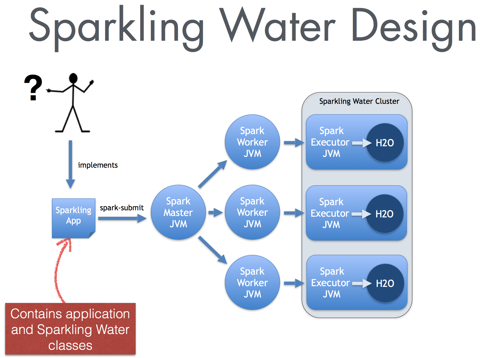
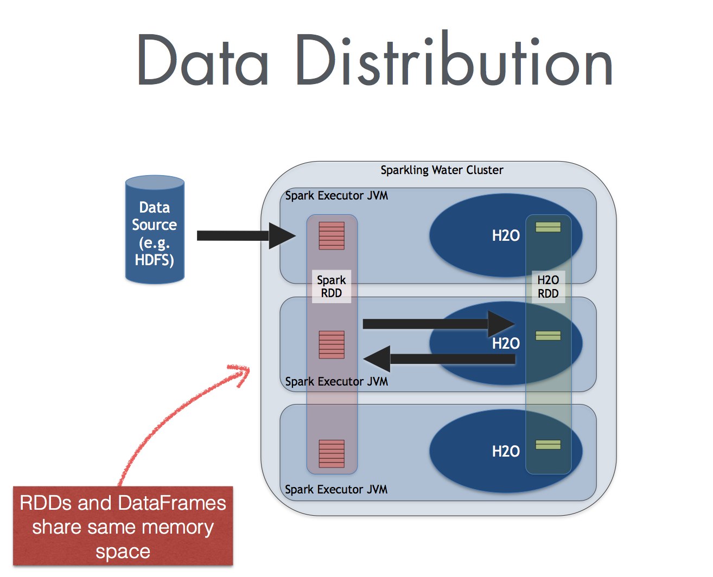

# Sparkling Water Development Documentation

##Table of Contents
- [Typical Use Case](#UseCase)
- [Requirements](#Req)
- [Features](#Features)
- [Design](#Design)
- [Supported Data Sources](#DataSource)
- [Supported Data Formats](#DataFormat)
- [Data Sharing](#DataShare)
- [Supported Execution Environments](#ExecEnv)
- [Provided Primitives](#ProvPrim)
- [H2O Initialization Sequence](#H2OInit)
- [Running on Select Target Platforms](#TargetPlatforms)
  - [Standalone](#Standalone)
  - [YARN](#YARN)
  - [Mesos](#Mesos)
- [Integration Tests](#IntegTest)
  - [Testing Environment](#TestEnv)
  - [Testing Scenarios](#TestCases)
  - [Integration Tests Example](#IntegExample)


--- 
 
 <a name="UseCase"></a>
## Typical Use-Case
Sparkling Water excels in leveraging existing Spark-based workflows that need to call advanced machine learning algorithms. A typical example involves data munging with help of Spark API, where a prepared table is passed to the H2O DeepLearning algorithm. The constructed DeepLearning model estimates different metrics based on the testing data, which can be used in the rest of the Spark workflow.

---

<a name="Req"></a>
## Requirements
 - Linux or Mac OSX platform
 - Java 1.7+
 - [Spark 1.2.0](http://spark.apache.org/downloads.html)

---

<a name="Features"></a>
## Features

Sparkling Water provides transparent integration for the H2O engine and its machine learning 
algorithms into the Spark platform, enabling:
 * use of H2O algorithms in Spark workflow
 * transformation between H2O and Spark data structures
 * use of Spark RDDs as input for H2O algorithms
 * transparent execution of Sparkling Water applications on top of Spark

---

<a name="Design"></a>
## Design

Sparkling Water is designed to be executed as a regular Spark application.
It provides a way to initialize H2O services on each node in the Spark cluster and access
data stored in data structures of Spark and H2O.

Since Sparkling Water is designed as Spark application, it is launched 
inside a Spark executor, which is created after application submission. 
At this point, H2O starts services, including distributed KV store and memory manager,
and orchestrates them into a cloud. The topology of the created cloud matches the topology of the underlying Spark cluster exactly.

 

When H2O services are running, it is possible to create H2O data structures, call H2O algorithms, and transfer values from/to RDD.

---

<a name="DataSource"></a> 
### Supported Data Sources
Currently, Sparkling Water can use the following data source types:
 - standard RDD API to load data and transform them into DataFrame
 - H2O API to load data directly into DataFrame from:
   - local file(s)
   - HDFS file(s)
   - S3 file(s)

---
<a name="DataFormat"></a>   
### Supported Data Formats
Sparkling Water can read data stored in the following formats:

 - CSV
 - SVMLight
 - ARFF


---
<a name="DataShare"></a>
### Data Sharing
Sparkling Water enables transformation between different types of RDDs and H2O's DataFrame, and vice versa.

 

When converting from DataFrame to RDD, a wrapper is created around the H2O DataFrame to provide an RDD-like API. In this case, no data is duplicated; instead, the data is served directly from then underlying DataFrame.

Converting in the opposite direction (from RDD to DataFrame) introduces data duplication, since it transfers data from RDD storage into DataFrame. However, data stored in DataFrame is heavily compressed. 

TODO: estimation of overhead

---
<a name="ExecEnv"></a> 
### Supported Execution Environments
Sparkling Water can run on top of Spark in the following ways:
 -  as a local cluster (master points to one of values `local`, `local[*]`, or `local-cluster[...]`
 -  as a standalone cluster
 -  in a YARN environment

---
<a name="ProvPrim"></a>
### Provided Primitives
The Sparkling Water provides following primitives, which are the basic classes used by Spark components:


| Concept        | Implementation class              | Description |
|----------------|-----------------------------------|-------------|
| H2O context    | `org.apache.spark.h2o.H2OContext` | H2O context that holds H2O state and provides primitives to transfer RDD into DataFrame and vice versa. It follows design principles of Spark primitives such as `SparkContext` or `SQLContext` |
| H2O entry point| `water.H2O`                       | Represents the entry point for accessing H2O services. It holds information about the actual H2O cluster, including a list of nodes and the status of distributed K/V datastore. |
| H2O DataFrame  | `water.fvec.DataFrame`            | DataFrame is the H2O data structure that represents a table of values. The table is column-based and provides column and row accessors. |
| H2O Algorithms | package `hex`                     | Represents the H2O machine learning algorithms library, including DeepLearning, GBM, RandomForest. |
 
---
<a name="H2OInit"></a>
### H2O Initialization Sequence
If `SparkContext` is available, initialize and start H2O context: 
```scala
val sc:SparkContext = ...
val hc = new H2OContext(sc).start()
```

The call will:
 1. Collect the number and host names of the executors (worker nodes) in the Spark cluster
 2. Launch H2O services on each detected executor
 3. Create a cloud for H2O services based on the list of executors
 4. Verify the H2O cloud status


---


## Configuration

### Build Environment
The environment must contain a property `SPARK_HOME` pointing to Spark distribution.

### Run Environment
The environment must contain a property `SPARK_HOME`.

### Sparkling Water Configuration Properties

The following configuration properties can be passed to Spark to configure Sparking Water:

| Property name | Default value | Description |
|---------------|---------------|-------------|
|`spark.ext.h2o.flatfile` | `true`| Use flatfile (instead of multicast) approach for creating H2O cloud |
|`spark.ext.h2o.cluster.size` | `-1` |Expected number of workers of H2O cloud. Use -1 to automatically detect the cluster size. This number must be equal to number of Spark workers.|
|`spark.ext.h2o.port.base`| `54321`| Base port used for individual H2O node configuration.|
|`spark.ext.h2o.port.incr`| `2` | Increment added to base port to find the next available port.|
|`spark.ext.h2o.cloud.timeout`| `60*1000` | Timeout (in msec) for cloud  |
|`spark.ext.h2o.spreadrdd.retries` | `10` | Number of retries for creation of an RDD covering all existing Spark executors. |
|`spark.ext.h2o.cloud.name`| `sparkling-water-` | Name of H2O cloud. |
|`spark.ext.h2o.node.log.level`| `INFO`| H2O internal log level used for launched H2O nodes. |
|`spark.ext.h2o.client.log.level`| `INFO`| H2O internal log level used for H2O client running inside Spark driver. |
|`spark.ext.h2o.network.mask`|--|Subnet selector for H2O if IP detection fails - useful for detecting the correct IP if 'spark.ext.h2o.flatfile' is false.* |
|`spark.ext.h2o.nthreads`|`-1`|Limit for number of threads used by H2O, default `-1` means unlimited.|

### Pass property to Sparkling Shell
TODO: example of arg passing from sparkling shell.

### Pass property to Spark submit

## Running

### Creating H2O Services
```scala
val sc:SparkContext = ...
val hc = new H2OContext(sc).start()
```

When the number of Spark nodes is known, it can be specified in `start` call:
```scala
val hc = new H2OContext(sc).start(3)
```

### Transforming DataFrame into RDD[T]
The `H2OContext` class provides the explicit conversion, `asRDD`, which creates an RDD-like wrapper around the  provided H2O DataFrame:
```scala
def asRDD[A <: Product: TypeTag: ClassTag](fr : DataFrame) : RDD[A]
```

The call expects the type `A` to create a correctly-typed RDD. 
The transformation requires type `A` to be bound by `Product` interface.
The relationship between the columns of DataFrame and the attributes of class `A` is based on name matching.

#### Example
```scala
val df: DataFrame = ...
val rdd = asRDD[Weather](df)

```

### Transforming DataFrame into SchemaRDD
The `H2OContext` class provides the explicit conversion, `asSchemaRDD`, which creates a SchemaRDD-like wrapper
around the provided H2O DataFrame. Technically, it provides the `RDD[sql.Row]` RDD API:
```scala
def asSchemaRDD(fr : DataFrame)(implicit sqlContext: SQLContext) : SchemaRDD
```

This call does not require any type of parameters, but since it creates `SchemaRDD` instances, it requires access to an instance of `SQLContext`. In this case, the instance is provided as an implicit parameter of the call. The parameter can be passed in two ways: as an explicit parameter or by introducing an implicit variable into the current context.

The schema of the created instance of the SchemaRDD is derived from the column name and the types of DataFrames specified.


#### Example

Using an explicit parameter in the call to pass sqlContext:
```scala
val sqlContext = new SQLContext(sc)
val schemaRDD = asSchemaRDD(dataFrame)(sqlContext)
```
or as implicit variable provided by actual environment:
```scala
implicit val sqlContext = new SQLContext(sc)
val schemaRDD = asSchemaRDD(dataFrame)
```


### Transforming RDD[T] into DataFrame
The `H2OContext` provides **implicit** conversion from the specified `RDD[A]` to DataFrame. As with conversion in the opposite direction, the type `A` has to satisfy the upper bound expressed by the type `Product`. The conversion will create a new DataFrame, transfer data from the specified RDD, and save it to the H2O K/V data store.

```scala
implicit def createDataFrame[A <: Product : TypeTag](rdd : RDD[A]) : DataFrame
```

#### Example
```scala
val rdd: RDD[Weather] = ...
import h2oContext._
val df: DataFrame = rdd // implicit call of H2OContext.createDataFrame[Weather](rdd) is used 
```

### Transforming SchemaRDD into DataFrame
The `H2OContext` provides **implicit** conversion from the specified `SchemaRDD` to DataFrame. The conversion will create a new DataFrame, transfer data from the specified RDD, and save it to the H2O K/V data store.

```scala
implicit def createDataFrame(rdd : SchemaRDD) : DataFrame
```

#### Example
```scala
val srdd: SchemaRDD = ...
import h2oContext._
val df: DataFrame = srdd // implicit call of H2OContext.createDataFrame(srdd) is used 
```


### Creating DataFrame from an Existing Key

If the H2O cluster already contains a loaded DataFrame referenced by the key `train.hex`, it is possible
to reference it from Sparkling Water by creating a proxy `DataFrame` instance using the key as the input:
```scala
val trainDF = new DataFrame("train.hex")
```

### Type mapping between H2O DataTypes and Spark SchemaRDD types
TBD


### Calling H2O Algorithms

 1. Create the parameters object that holds references to input data and parameters specific for the algorithm:
 ```scala
 val train: RDD = ...
 val valid: DataFrame = ...
 
 val gbmParams = new GBMParameters()
 gbmParams._train = train
 gbmParams._valid = valid
 gbmParams._response_column = 'bikes
 gbmParams._ntrees = 500
 gbmParams._max_depth = 6
 ```
 2. Create a model builder:
 ```scala
 val gbm = new GBM(gbmParams)
 ```
 3. Invoke the model build job and block until the end of computation (`trainModel` is an asynchronous call by default):
 ```scala
 val gbmModel = gbm.trainModel.get
 ```
 

## Running Unit Tests
JVM options -Dspark.testing=true -Dspark.test.home=/Users/michal/Tmp/spark/spark-1.1.0-bin-cdh4/

## Overhead Estimation
TBD

## Application Development

## Sparkling Water configuration

TODO: used datasources, how data is moved to spark
TODO: platform testing - mesos, SIMR

---

<a name="TargetPlatforms"></a>
# Running on Select Target Platforms

<a name="Standalone"></a>
## Standalone
[Spark documentation - running Standalone cluster](http://spark.apache.org/docs/latest/spark-standalone.html)

<a name="YARN"></a>
## YARN
[Spark documentation - running Spark Application on YARN](http://spark.apache.org/docs/latest/running-on-yarn.html)

<a name="Mesos"></a>
## Mesos
[Spark documentation - running Spark Application on Mesos](http://spark.apache.org/docs/latest/running-on-mesos.html)

---
<a name="IntegTest"></a>
# Integration Tests

---
<a name="TestEnv"></a>
## Testing Environments
 * Local - corresponds to setting Spark `MASTER` variable to one of `local`, or `local[*]`, or `local-cluster[_,_,_]` values
 * Standalone cluster - the `MASTER` variable points to existing standalone Spark cluster `spark://...` 
   * ad-hoc build cluster
   * CDH5.3 provided cluster
 * YARN cluster - the `MASTER variable contains `yarn-client` or `yarn-cluster` values

---

<a name="TestCases"></a>
## Testing Scenarios
 1. Initialize H2O on top of Spark by running  `new H2OContext(sc).start()` and verifying that H2O was properly initialized on all Spark nodes. 
 2. Load data with help from the H2O API from various data sources:
   * local disk
   * HDFS
   * S3N
 3. Convert from `RDD[T]` to `DataFrame`
 4. Convert from `SchemaRDD` to `DataFrame`
 5. Convert from `DataFrame` to `RDD` 
 6. Convert from `DataFrame` to `SchemaRDD`
 7. Integrate with H2O Algorithms using RDD as algorithm input
 8. Integrate with MLlib Algorithms using DataFrame as algorithm input (KMeans)
 9. Integrate with MLlib pipelines (TBD)

---

<a name="IntegExample"></a> 
## Integration Tests Example

The following code reflects the use cases listed above. The code is executed in all testing environments (if applicable): 
 * local
 * standalone cluster
 * YARN
Spark 1.2.0 or later is required.

1. Initialize H2O:

  ```scala
  import org.apache.spark.h2o._
  val sc = new SparkContext(conf)
  val h2oContext = new H2OContext(sc).start()
  import h2oContext._
  ```
2. Load data: 
   * From the local disk:
  
      ```scala
      val sc = new SparkContext(conf)
      import org.apache.spark.h2o._
  val h2oContext = new H2OContext(sc).start()
   import java.io.File
   val df: DataFrame = new DataFrame(new File("/datasets/allyears2k_headers.csv.gz"))
   ```
     > Note: The file must be present on all nodes.
     
   * From HDFS:
 
   ```scala
  val sc = new SparkContext(conf)
   import org.apache.spark.h2o._
  val h2oContext = new H2OContext(sc).start()
  val path = "hdfs://mr-0xd6.0xdata.loc/datasets/airlines_all.csv"
   val uri = new java.net.URI(path)
  val airlinesData = new DataFrame(uri)
   ```
   * From S3N: 
  
   ```scala
  val sc = new SparkContext(conf)
  import org.apache.spark.h2o._
  val h2oContext = new H2OContext(sc).start()
   val path = "s3n://h2o-airlines-unpacked/allyears2k.csv"
   val uri = new java.net.URI(path)
  val airlinesData = new DataFrame(uri)
   ```
       > Spark/H2O needs to know the AWS credentials specified in `core-site.xml`. The credentials are passed via        `HADOOP_CONF_DIR` that points to a configuration directory with `core-site.xml`.
3. Convert from `RDD[T]` to `DataFrame`:

  ```scala
  val sc = new SparkContext(conf)
  import org.apache.spark.h2o._
  val h2oContext = new H2OContext(sc).start()
  val rdd = sc.parallelize(1 to 1000, 100).map( v => IntHolder(Some(v)))
  val dataFrame:DataFrame = h2oContext.createDataFrame(rdd)
  ```
4. Convert from `SchemaRDD` to `DataFrame`:

  ```scala
  val sc = new SparkContext(conf)
  import org.apache.spark.h2o._
  val h2oContext = new H2OContext(sc).start()
  import org.apache.spark.sql._
  val sqlContext = new SQLContext(sc)
  import sqlContext._
  val srdd:SchemaRDD = sc.parallelize(1 to 1000, 100).map(v => IntHolder(Some(v)))
  val dataFrame = h2oContext.toDataFrame(srdd)
  ```
5. Convert from `DataFrame` to `RDD[T]`:

  ```scala
  val sc = new SparkContext(conf)
  import org.apache.spark.h2o._
  val h2oContext = new H2OContext(sc).start()
  val rdd = sc.parallelize(1 to 1000, 100).map( v => IntHolder(Some(v)))
  val dataFrame:DataFrame = h2oContext.createDataFrame(rdd)  
  val newRdd = h2oContext.asRDD[IntHolder](dataFrame)
  ```
6. Convert from `DataFrame` to `SchemaRDD`:

  ```scala
  val sc = new SparkContext(conf)
  import org.apache.spark.h2o._
  val h2oContext = new H2OContext(sc).start()
  import org.apache.spark.sql._
  val sqlContext = new SQLContext(sc)
  import sqlContext._
  val srdd:SchemaRDD = sc.parallelize(1 to 1000, 100).map(v => IntHolder(Some(v)))
  val dataFrame = h2oContext.toDataFrame(srdd)
  val newRdd = h2oContext.asSchemaRDD(dataFrame)(sqlContext)
  ``` 
7. Integrate with H2O Algorithms using RDD as algorithm input:

  ```scala
  val sc = new SparkContext(conf)
  import org.apache.spark.h2o._
  import org.apache.spark.examples.h2o._
  val h2oContext = new H2OContext(sc).start()
  val path = "/tmp/prostate.csv"
  val prostateText = sc.textFile(path)
  val prostateRDD = prostateText.map(_.split(",")).map(row => ProstateParse(row))
  import hex.tree.gbm.GBM
  import hex.tree.gbm.GBMModel.GBMParameters
  import h2oContext._
  val train:DataFrame = prostateRDD
  val gbmParams = new GBMParameters()
  gbmParams._train = train
  gbmParams._response_column = 'CAPSULE
  gbmParams._ntrees = 10
  val gbmModel = new GBM(gbmParams).trainModel.get
  ```
8. Integrate with MLlib algorithms:

  ```scala
  val sc = new SparkContext(conf)
  import org.apache.spark.h2o._
  import org.apache.spark.examples.h2o._
  import java.io.File
  val h2oContext = new H2OContext(sc).start()
  val path = "/tmp/prostate.csv"
  val prostateDF = new DataFrame(new File(path))
  val prostateRDD = h2oContext.asRDD[Prostate](prostateDF)
  import org.apache.spark.mllib.clustering.KMeans
  import org.apache.spark.mllib.linalg.Vectors
  val train = prostateRDD.map( v => Vectors.dense(v.CAPSULE.get*1.0, v.AGE.get*1.0, v.DPROS.get*1.0,v.DCAPS.get*1.0, v.GLEASON.get*1.0))
  val clusters = KMeans.train(train, 5, 20)
  ```
  
