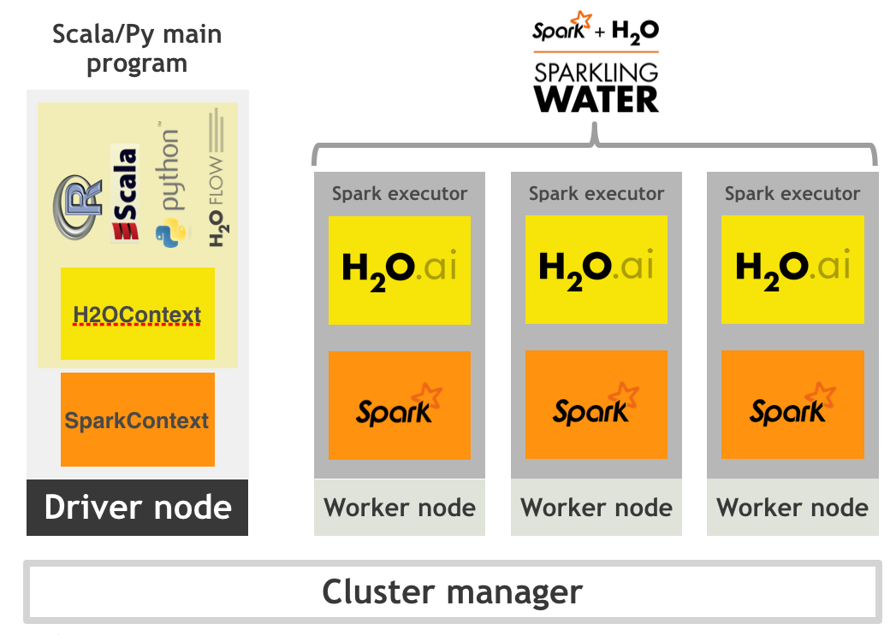

Sparkling Water Development Documentation
=========================================

The Sparkling Water Development Documentation consists of the following
sections

-  `Typical Use Case <#typical-use-case>`_
-  `Requirements <#requirements>`__
-  `Design <#design>`__
-  `Features <#features>`__
-  `Running on Select Target Platforms <#running-on-select-target-platforms>`__
-  `Configuration <#configuration>`__
-  `Running Sparkling Water <#running-sparkling-water>`__
-  `Starting H2O Services <#starting-h2o-services>`__
-  `Converting an H2OFrame into an RDD[T] <#converting-an-h2oframe-into-an-rdd-t>`__
-  `Converting an H2OFrame into a DataFrame <#converting-an-h2oframe-into-a-dataframe>`__
-  `Converting an RDD[T] into an H2OFrame <#converting-an-rdd-t-into-an-h2oframe>`__
-  `Creating an H2OFrame from an existing key <#creating-an-h2oframe-from-an-existing-key>`__
-  `Type Mapping <#type-mapping>`__
-  `Calling H2O Algorithms <#calling-h2o-algorithms>`__
-  `Application Development <#application-development>`__
-  `Sparkling Water Configuration <#sparkling-water-configuration>`__
-  `Integration Tests <#integration-tests>`__
-  `Troubleshooting and Log Locations <#troubleshooting-and-log-locations>`__
-  `H2OFrame as Spark's Data Source <#h2oframe-as-spark-s-data-source>`__
-  `Sparkling Water Tuning <#sparkling-water-tuning>`__
-  `Sparkling Water and Zeppelin <#sparkling-water-and-zeppelin>`__

--------------

Typical Use Case 
----------------

Sparkling Water excels in leveraging existing Spark-based workflows that
need to call advanced machine learning algorithms. A typical example
involves data munging with help of Spark API, where a prepared table is
passed to the H2O DeepLearning algorithm. The constructed DeepLearning
model estimates different metrics based on the testing data, which can
be used in the rest of the Spark workflow.

--------------

Requirements
------------

- Linux or Mac OSX platform 
- Java 1.7 or greater 
- `Spark 1.3.0 or greater <http://spark.apache.org/downloads.html>`__

--------------

Design
------

Sparkling Water is designed to be executed as a regular Spark
application. It provides a way to initialize H2O services on each node
in the Spark cluster and access data stored in data structures of Spark
and H2O.

Because Sparkling Water is designed as Spark application, it is launched
inside a Spark executor, which is created after application submission.
At this point, H2O starts services, including distributed KV store and
memory manager, and orchestrates them into a cloud. The topology of the
created cloud matches the topology of the underlying Spark cluster
exactly.

   Topology

When H2O services are running, it is possible to create H2O data
structures, call H2O algorithms, and transfer values from/to RDD.

--------------

Features
--------

Sparkling Water provides transparent integration for the H2O engine and
its machine learning algorithms into the Spark platform, enabling: 

- the use of H2O algorithms in Spark workflow 
- transformation between H2O and Spark data structures 
- the use of Spark RDDs as input for H2O algorithms
- transparent execution of Sparkling Water applications on top of Spark

Supported Data Sources 
~~~~~~~~~~~~~~~~~~~~~~

Currently, Sparkling Water can use the following data source types: 

- Standard RDD API to load data and transform them into ``H2OFrame`` 
- H2O API to load data directly into ``H2OFrame`` from: 

 - local file(s) 
 - HDFS file(s)
 - S3 file(s)

Data Sharing 
~~~~~~~~~~~~

Sparkling Water enables transformation between different types of Spark ``RDD`` and ``H2OFrame``, and vice versa.

.. figure:: design-doc/images/DataShare.png
   :alt: Data Sharing

   Data Sharing

When converting from ``H2OFrame`` to ``RDD``, a wrapper is created around the ``H2OFrame`` to provide an RDD-like API. In this case, no data is duplicated; instead, the data is served directly from then underlying ``H2OFrame``.

Converting in the opposite direction (i.e, from Spark ``RDD``/``DataFrame`` to ``H2OFrame``) needs evaluation of data stored in Spark ``RDD`` and transfer them from RDD storage into ``H2OFrame``. However, data stored in ``H2OFrame`` is heavily compressed.

Provided Primitives
~~~~~~~~~~~~~~~~~~~

The Sparkling Water provides following
primitives, which are the basic classes used by Spark components:

+-------------------+--------------------------------------+----------------+
| Concept           | Implementation class                 | Description    |
+===================+======================================+================+
| H2O context       | ``org.apache.spark.h2o.H2OContext``  | H2O context    |
|                   |                                      | that holds H2O |
|                   |                                      | state and      |
|                   |                                      | provides       |
|                   |                                      | primitives to  |
|                   |                                      | transfer RDD   |
|                   |                                      | into H2OFrame  |
|                   |                                      | and vice       |
|                   |                                      | versa. It      |
|                   |                                      | follows design |
|                   |                                      | principles of  |
|                   |                                      | Spark          |
|                   |                                      | primitives     |
|                   |                                      | such as        |
|                   |                                      | ``SparkContext |
|                   |                                      | ``             |
|                   |                                      | or             |
|                   |                                      | ``SQLContext`` |
+-------------------+--------------------------------------+----------------+
| H2O entry point   | ``water.H2O``                        | Represents the |
|                   |                                      | entry point    |
|                   |                                      | for accessing  |
|                   |                                      | H2O services.  |
|                   |                                      | It holds       |
|                   |                                      | information    |
|                   |                                      | about the      |
|                   |                                      | actual H2O     |
|                   |                                      | cluster,       |
|                   |                                      | including a    |
|                   |                                      | list of nodes  |
|                   |                                      | and the status |
|                   |                                      | of distributed |
|                   |                                      | K/V datastore. |
+-------------------+--------------------------------------+----------------+
| H2O H2OFrame      | ``water.fvec.H2OFrame``              | H2OFrame is    |
|                   |                                      | the H2O data   |
|                   |                                      | structure that |
|                   |                                      | represents a   |
|                   |                                      | table of       |
|                   |                                      | values. The    |
|                   |                                      | table is       |
|                   |                                      | column-based   |
|                   |                                      | and provides   |
|                   |                                      | column and row |
|                   |                                      | accessors.     |
+-------------------+--------------------------------------+----------------+
| H2O Algorithms    | package ``hex``                      | Represents the |
|                   |                                      | H2O machine    |
|                   |                                      | learning       |
|                   |                                      | algorithms     |
|                   |                                      | library,       |
|                   |                                      | including      |
|                   |                                      | DeepLearning,  |
|                   |                                      | GBM,           |
|                   |                                      | RandomForest.  |
+-------------------+--------------------------------------+----------------+

--------------

Running on Select Target Platforms
----------------------------------

Sparkling Water can run on top of Spark in the various ways including on a local cluster, on a standalone cluster, on a YARN cluster, or on Mesos. 

**Note**: If the Sparkling Water application is submitted using the ``./spark-submit``
script, it is necessary to set the ``spark.repl.class.uri`` configuration
property with the ``H2OInterpreter.classServerUri`` inside the
application code. So for example, the spark config would look like:

 ::

    val conf: SparkConf = new SparkConf().setAppName("Sparkling Water Application").set("spark.repl.class.uri",H2OInterpreter.classServerUri)

This step does not have to be done when starting Sparkling Water using the ``./sparkling-shell`` script. 

Local
~~~~~

When running Sparkling Water on a local cluster, the Spark master variable points to one of the following values:

- ``local`` 
- ``local[*]``
- ``local-cluster[...]``

Standalone
~~~~~~~~~~

Refer to the Spark documentation for `Spark Standalone Mode <http://spark.apache.org/docs/latest/spark-standalone.html>`__.

YARN
~~~~

Refer to the Spark documentation for `Running Spark on YARN <http://spark.apache.org/docs/latest/running-on-yarn.html>`__.

When running on YARN, the process for Submitting Sparkling Water applications varies depending on the type of YARN cluster you are running. 

**CDH or Apache Hadoop**

When submitting the Sparkling Water application to a CDH or Apache Hadoop
cluster, the command to submit may look like:

::

    ./spark-submit --master=yarn-client --class water.SparklingWaterDriver --conf "spark.yarn.am.extraJavaOptions=-XX:MaxPermSize=384m -Dhdp.version=current"
    --driver-memory=8G --num-executors=3 --executor-memory=3G --conf "spark.executor.extraClassPath=-XX:MaxPermSize=384m -Dhdp.version=current"
    sparkling-water-assembly-1.5.11-all.jar

**HDP Cluster**

When submitting a Sparkling Water application to an HDP cluster, the command
to submit may look like:

::

    ./spark-submit --master=yarn-client --class water.SparklingWaterDriver --conf "spark.yarn.am.extraJavaOptions=-XX:MaxPermSize=384m -Dhdp.version=current"
    --driver-memory=8G --num-executors=3 --executor-memory=3G --conf "spark.executor.extraClassPath=-XX:MaxPermSize=384m -Dhdp.version=current"
    sparkling-water-assembly-1.5.11-all.jar

Apart from the typical Spark configuration, it is necessary to add
``-XX:MaxPermSize=384m`` (or higher, but 384m is minimum) to both
``spark.executor.extraClassPath`` and ``spark.yarn.am.extraJavaOptions``
(or for client mode, ``spark.driver.extraJavaOptions`` for cluster mode)
configuration properties in order to run Sparkling Water correctly.

The only difference between HDP cluster and both CDH and Apache Hadoop
clusters is that we need to add ``-Dhdp.version=current`` to both
``spark.executor.extraClassPath`` and ``spark.yarn.am.extraJavaOptions``
(resp., ``spark.driver.extraJavaOptions``) configuration properties in
the HDP case.

Mesos
~~~~~

Refer to the Spark documentation for `Running Spark on Mesos <http://spark.apache.org/docs/latest/running-on-mesos.html>`__.

Configuration
-------------

This section describes the build and run environments for Sparkling Water. It also includes a set of configuration properties to pass to Spark.

Build Environment 
~~~~~~~~~~~~~~~~~

The build environment must contain the ``SPARK_HOME`` property that points to the Spark distribution.

Run Environment
~~~~~~~~~~~~~~~

The run environment must contain the ``SPARK_HOME`` property that points to the Spark distribution.

Sparkling Water Configuration Properties
~~~~~~~~~~~~~~~~~~~~~~~~~~~~~~~~~~~~~~~~

The following configuration properties can be passed to Spark to configure Sparking Water:

**Configuration properties independent on selected backend**

+--------------------------------------------------+----------------------------------+---------------------------+
| Property name                                    | Default value                    | Description               |
+==================================================+==================================+===========================+
| **Generic parameters**                           |                                  |                           |
|                                                  |                                  |                           |
+--------------------------------------------------+----------------------------------+---------------------------+
| ``spark.ext.h2o.cloud.name``                     | ``sparkling-water``              | Name of the H2O cloud.    |
+--------------------------------------------------+----------------------------------+---------------------------+
| ``spark.ext.h2o.nthreads``                       | ``-1``                           | Limit for the number of   |
|                                                  |                                  | threads used by H2O. The  |
|                                                  |                                  | default ``-1`` means      |
|                                                  |                                  | unlimited threads.        |
+--------------------------------------------------+----------------------------------+---------------------------+
| ``spark.ext.h2o.disable.ga``                     | ``false``                        | Disable Google Analytics  |
|                                                  |                                  | tracking for embedded H2O.|
+--------------------------------------------------+----------------------------------+---------------------------+
| ``spark.ext.h2o.repl.enabled``                   | ``true``                         | Decides whether H2O repl  |
|                                                  |                                  | is initialized or not. The|
|                                                  |                                  | repl is initialized by    |
|                                                  |                                  | default.                  |
+--------------------------------------------------+----------------------------------+---------------------------+
| ``spark.ext.scala.int.default.num``              | ``1``                            | Number of executors       |
|                                                  |                                  | started at the start of   |
|                                                  |                                  | H2O services.             |
+--------------------------------------------------+----------------------------------+---------------------------+
|``spark.ext.h2o.topology.change.listener.enabled``| ``true``                         | Enables or disables the   |
|                                                  |                                  | listener that kills the   |
|                                                  |                                  | H2O cloud on the change of|
|                                                  |                                  | the underlying cluster's  |
|                                                  |                                  | topology.                 |
+--------------------------------------------------+----------------------------------+---------------------------+
| ``spark.ext.h2o.spark.version.check.enable``     | ``true``                         | If enabled, checks if the |
|                                                  |                                  | runtime Spark version     |
|                                                  |                                  | matches the build time    |
|                                                  |                                  | Spark version.            |
+--------------------------------------------------+----------------------------------+---------------------------+
|``spark.ext.h2o.exit.on.unsupported.spark.param`` | ``true``                         | If unsupported Spark      |
|                                                  |                                  | parameters are detectect, |
|                                                  |                                  | then the application is   |
|                                                  |                                  | forced to shutdown.       |
+--------------------------------------------------+----------------------------------+---------------------------+
| ``spark.ext.h2o.jks``                            | ``null``                         | Path to the Java KeyStore |
|                                                  |                                  | file.                     |
+--------------------------------------------------+----------------------------------+---------------------------+
| ``spark.ext.h2o.jks.pass``                       | ``null``                         | Password for the Java     |
|                                                  |                                  | KeyStore file             |
+--------------------------------------------------+----------------------------------+---------------------------+
| ``spark.ext.h2o.hash.login``                     | ``false``                        | Enables hash login.       |
+--------------------------------------------------+----------------------------------+---------------------------+
| ``spark.ext.h2o.ldap.login``                     | ``false``                        | Enables LDAP login.       |
+--------------------------------------------------+----------------------------------+---------------------------+
| ``spark.ext.h2o.kerberos.login``                 | ``false``                        | Enables Kerberos login.   |
+--------------------------------------------------+----------------------------------+---------------------------+
| ``spark.ext.h2o.login.conf``                     | ``null``                         | The login configuration   |
|                                                  |                                  | file.                     |
+--------------------------------------------------+----------------------------------+---------------------------+
| ``spark.ext.h2o.user.name``                      | ``null``                         | Override the user name    |
|                                                  |                                  | for the cluster.          |
+--------------------------------------------------+----------------------------------+---------------------------+
| **H2O client parameters**                        |                                  |                           |
+--------------------------------------------------+----------------------------------+---------------------------+
| ``spark.ext.h2o.client.ip``                      | ``null``                         | IP of the H2O client node.|
+--------------------------------------------------+----------------------------------+---------------------------+
| ``spark.ext.h2o.client.iced.dir``                | ``null``                         | Location of the iced      |
|                                                  |                                  | directory for the driver  |
|                                                  |                                  | instance.                 |
+--------------------------------------------------+----------------------------------+---------------------------+
| ``spark.ext.h2o.client.log.level``               | ``INFO``                         | H2O internal log level    |
|                                                  |                                  | used for the H2O client   |
|                                                  |                                  | running inside Spark      |
|                                                  |                                  | driver.                   |
+--------------------------------------------------+----------------------------------+---------------------------+
| ``spark.ext.h2o.client.log.dir``                 |``System.getProperty("user.dir")``| The location of H2O logs  |
|                                                  |``+ File.separator + h2ologs``    | on the driver machine.    |
+--------------------------------------------------+----------------------------------+---------------------------+
| ``spark.ext.h2o.client.port.base``               | ``54321``                        | The port on which the H2O |
|                                                  |                                  | client publishes its API. |
|                                                  |                                  | If the port is already    |
|                                                  |                                  | occupied, the next odd    |
|                                                  |                                  | port is tried and so on.  |
+--------------------------------------------------+----------------------------------+---------------------------+
| ``spark.ext.h2o.client.web.port``                | ``-1``                           |Exact client port to       |
|                                                  |                                  |access the web UI. The     |
|                                                  |                                  |value ``-1`` means         |
|                                                  |                                  |automatic search for a     |
|                                                  |                                  |free port starting at      |
|                                                  |                                  |``spark.ext.h2o.port-base``|
+--------------------------------------------------+----------------------------------+---------------------------+
| ``spark.ext.h2o.client.verbose``                 | ``false``                        | The client outpus verbosed|
|                                                  |                                  | log output directly into  |
|                                                  |                                  | the console. Enabling this|
|                                                  |                                  | flag increases the client |
|                                                  |                                  | log level to INFO.        |
+--------------------------------------------------+----------------------------------+---------------------------+
| ``spark.ext.h2o.client.network.mask``            | --                               | Subnet selector for the   |
|                                                  |                                  | H2O client. This disables |
|                                                  |                                  | using the IP reported by  |
|                                                  |                                  | Spark but tries to find   |
|                                                  |                                  | an IP based on the        |
|                                                  |                                  | specifed mask.            |
+--------------------------------------------------+----------------------------------+---------------------------+

--------------

Internal Backend Configuration Properties
~~~~~~~~~~~~~~~~~~~~~~~~~~~~~~~~~~~~~~~~~

+----------------------------------------+------------------------------------+------------------+
| Property name                          | Default value                      | Description      |
+========================================+====================================+==================+
| **Generic parameters**                 |                                    |                  |
+----------------------------------------+------------------------------------+------------------+
| ``spark.ext.h2o.flatfile``             | ``true``                           | Use flatfile     |
|                                        |                                    | (instead of      |
|                                        |                                    | multicast)       |
|                                        |                                    | approach for     |
|                                        |                                    | creating H2O     |
|                                        |                                    | cloud.           |
+----------------------------------------+------------------------------------+------------------+
| ``spark.ext.h2o.clustersize``          | ``-1``                             | Expected         |
|                                        |                                    | number of        |
|                                        |                                    | workers of H2O   |
|                                        |                                    | cloud. Use -1    |
|                                        |                                    | to automatically |
|                                        |                                    | detect the       |
|                                        |                                    | cluster size.    |
|                                        |                                    | This number must |
|                                        |                                    | be equal to the  |
|                                        |                                    | number of Spark  |
|                                        |                                    | workers.         |
+----------------------------------------+------------------------------------+------------------+
| ``spark.ext.h2o.port.base``            | ``54321``                          | Base port used   |
|                                        |                                    | for individual   |
|                                        |                                    | H2O node         |
|                                        |                                    | configuration.   |
+----------------------------------------+------------------------------------+------------------+
| ``spark.ext.h2o.cloud.timeout``        | ``60*1000``                        | Timeout (in msec |
|                                        |                                    | for the cloud.   |
+----------------------------------------+------------------------------------+------------------+
| ``spark.ext.h2o.dummy.rdd.mul.factor`` | ``10``                             | Multiplication   |
|                                        |                                    | factor for dummy |
|                                        |                                    | RDD generation.  |
|                                        |                                    | The size of the  |
|                                        |                                    | dummy RDD is     |
|                                        |                                    | spark.ext.h2o.   |
|                                        |                                    | cluster.size\*   |
|                                        |                                    | spark.ext.h2o.   |
|                                        |                                    | dummy.rdd.mul.   |
|                                        |                                    | factor.          |
+----------------------------------------+------------------------------------+------------------+
| ``spark.ext.h2o.spreadrdd.retries``    | ``10``                             | The number of    |
|                                        |                                    | retries for      |
|                                        |                                    | creation of an   |
|                                        |                                    | RDD covering all |
|                                        |                                    | existing Spark   |
|                                        |                                    | executors.       |
+----------------------------------------+------------------------------------+------------------+
| ``spark.ext.h2o.default.cluster.size`` | ``20``                             | Starting size of |
|                                        |                                    | the cluster in   |
|                                        |                                    | case that size is|
|                                        |                                    | not explicitly   |
|                                        |                                    | passed.          |
+----------------------------------------+------------------------------------+------------------+
| ``spark.ext.h2o.node.iced.dir``        | ``null``                           | Location of iced |
|                                        |                                    | directory for    |
|                                        |                                    | Spark nodes.     |
+----------------------------------------+------------------------------------+------------------+
| ``spark.ext.h2o.subseq.tries``         | ``5``                              | Subsequent       |
|                                        |                                    | successful tries |
|                                        |                                    | to figure out the|
|                                        |                                    | size of the Spark|
|                                        |                                    | clusters that are|
|                                        |                                    | producing the    |
|                                        |                                    | same number of   |
|                                        |                                    | nodes.           |
+----------------------------------------+------------------------------------+------------------+
| **H2O server node parameters**         |                                    |                  |
+----------------------------------------+------------------------------------+------------------+
| ``spark.ext.h2o.node.network.mask``    | --                                 | Subnet selector  |
|                                        |                                    | for H2O running  |
|                                        |                                    | inside Spark     |
|                                        |                                    | executors. This  |
|                                        |                                    | disables using   |
|                                        |                                    | the IP reported  |
|                                        |                                    | by Spark, but    |
|                                        |                                    | but tries to find|
|                                        |                                    | the IP based on  |
|                                        |                                    | the specified    |
|                                        |                                    | mask.            |
+----------------------------------------+------------------------------------+------------------+
| ``spark.ext.h2o.node.log.level``       | ``INFO``                           | H2O internal log |
|                                        |                                    | level used for   |
|                                        |                                    | launched H2O     |
|                                        |                                    | nodes.           |
+----------------------------------------+------------------------------------+------------------+
| ``spark.ext.h2o.node.log.dir``         | ``System.getProperty("user.dir")`` | The location of  |
|                                        | ``+ File.separator + h2ologs``     | H2O logs on the  |
|                                        | or the YARN container directory.   | executor machine.|
+----------------------------------------+------------------------------------+------------------+

--------------

Running Sparkling Water
-----------------------

Starting H2O Services
~~~~~~~~~~~~~~~~~~~~~

.. code:: scala

    val sc:SparkContext = ...
    val hc = H2OContext.getOrCreate(sc)

Memory Allocation
~~~~~~~~~~~~~~~~~

H2O resides in the same executor JVM as Spark. The memory provided for H2O is configured via Spark; refer to `Spark configuration <http://spark.apache.org/docs/1.4.0/configuration.html>`__ for more details.

Generic Configuration
'''''''''''''''''''''

 * Configure the Executor memory (i.e., memory available for H2O) via the Spark configuration property ``spark.executor.memory``. For example, ``bin/sparkling-shell --conf spark.executor.memory=5g`` or configure the property in ``$SPARK_HOME/conf/spark-defaults.conf``.
     
 * Configure the Driver memory (i.e., memory available for H2O client running inside Spark driver) via the Spark configuration property ``spark.driver.memory``. For example, ``bin/sparkling-shell --conf spark.driver.memory=4g`` or configure the property in ``$SPARK_HOME/conf/spark-defaults.conf``
      
YARN-Specific Configuration
'''''''''''''''''''''''''''

- Refer to the `Spark documentation <http://spark.apache.org/docs/1.4.0/running-on-yarn.html>`__.

- For JVMs that require a large amount of memory, we strongly recommend configuring the maximum amount of memory available for individual mappers. For information on how to do this using YARN, refer to `http://docs.h2o.ai/h2o/latest-stable/h2o-docs/hadoop.html <http://docs.h2o.ai/h2o/latest-stable/h2o-docs/hadoop.html>`__

Converting an H2OFrame into an RDD[T]
~~~~~~~~~~~~~~~~~~~~~~~~~~~~~~~~~~~~~

The ``H2OContext`` class provides the explicit conversion, ``asRDD``, which creates an RDD-like wrapper around the provided H2O's H2OFrame:

.. code:: scala

    def asRDD[A <: Product: TypeTag: ClassTag](fr : H2OFrame) : RDD[A]

The call expects the type ``A`` to create a correctly-typed RDD. The
conversion requires type ``A`` to be bound by ``Product`` interface. The
relationship between the columns of H2OFrame and the attributes of class
``A`` is based on name matching.

Example
'''''''

.. code:: scala

    val df: H2OFrame = ...
    val rdd = asRDD[Weather](df)

--------------

Converting an H2OFrame into a DataFrame
~~~~~~~~~~~~~~~~~~~~~~~~~~~~~~~~~~~~~~~

The ``H2OContext`` class
provides the explicit conversion, ``asDataFrame``, which creates a
DataFrame-like wrapper around the provided H2O H2OFrame. Technically, it
provides the ``RDD[sql.Row]`` RDD API:

.. code:: scala

    def asDataFrame(fr : H2OFrame)(implicit sqlContext: SQLContext) : DataFrame

This call does not require any type of parameters, but since it creates
``DataFrame`` instances, it requires access to an instance of
``SQLContext``. In this case, the instance is provided as an implicit
parameter of the call. The parameter can be passed in two ways: as an
explicit parameter or by introducing an implicit variable into the
current context.

The schema of the created instance of the ``DataFrame`` is derived from
the column name and the types of ``H2OFrame`` specified.

Example
'''''''

Using an explicit parameter in the call to pass sqlContext:

.. code:: scala

    val sqlContext = new SQLContext(sc)
    val schemaRDD = asDataFrame(h2oFrame)(sqlContext)

or as implicit variable provided by actual environment:

.. code:: scala

    implicit val sqlContext = new SQLContext(sc)
    val schemaRDD = asDataFrame(h2oFrame)

--------------

Converting an RDD[T] into an H2OFrame
~~~~~~~~~~~~~~~~~~~~~~~~~~~~~~~~~~~~~

The ``H2OContext`` provides
**implicit** conversion from the specified ``RDD[A]`` to ``H2OFrame``.
As with conversion in the opposite direction, the type ``A`` has to
satisfy the upper bound expressed by the type ``Product``. The
conversion will create a new ``H2OFrame``, transfer data from the
specified RDD, and save it to the H2O K/V data store.

.. code:: scala

    implicit def asH2OFrame[A <: Product : TypeTag](rdd : RDD[A]) : H2OFrame

The API also provides explicit version which allows for specifying name
for resulting H2OFrame.

.. code:: scala

    def asH2OFrame[A <: Product : TypeTag](rdd : RDD[A], frameName: Option[String]) : H2OFrame

Example
'''''''

.. code:: scala

    val rdd: RDD[Weather] = ...
    import h2oContext._
    // implicit call of H2OContext.asH2OFrame[Weather](rdd) is used 
    val hf: H2OFrame = rdd
    // Explicit call of of H2OContext API with name for resulting H2O frame
    val hfNamed: H2OFrame = h2oContext.asH2OFrame(rdd, Some("h2oframe"))

Creating an H2OFrame from an Existing Key
~~~~~~~~~~~~~~~~~~~~~~~~~~~~~~~~~~~~~~~~~

If the H2O cluster already contains a loaded ``H2OFrame`` referenced by
the key ``train.hex``, it is possible to reference it from Sparkling
Water by creating a proxy ``H2OFrame`` instance using the key as the
input:

.. code:: scala

    val trainHF = new H2OFrame("train.hex")

Type Mapping
~~~~~~~~~~~~

**Type mapping between H2OFrame types and Spark DataFrame types**

For all primitive Scala types or Spark SQL types
(see ``org.apache.spark.sql.types``) that can be part of the Spark
RDD/DataFrame, we provide mapping into H2O vector types (numeric,
categorical, string, time, UUID - see ``water.fvec.Vec``):

+----------------------+-----------------+------------+
| Scala type           | SQL type        | H2O type   |
+======================+=================+============+
| *NA*                 | BinaryType      | Numeric    |
+----------------------+-----------------+------------+
| Byte                 | ByteType        | Numeric    |
+----------------------+-----------------+------------+
| Short                | ShortType       | Numeric    |
+----------------------+-----------------+------------+
| Integer              | IntegerType     | Numeric    |
+----------------------+-----------------+------------+
| Long                 | LongType        | Numeric    |
+----------------------+-----------------+------------+
| Float                | FloatType       | Numeric    |
+----------------------+-----------------+------------+
| Double               | DoubleType      | Numeric    |
+----------------------+-----------------+------------+
| String               | StringType      | String     |
+----------------------+-----------------+------------+
| Boolean              | BooleanType     | Numeric    |
+----------------------+-----------------+------------+
| java.sql.Timestamp   | TimestampType   | Time       |
+----------------------+-----------------+------------+

**Type Mapping between H2OFrame types and RDD[T] types**

As type T, we support the following types:

+--------------------------------------------------+
| T                                                |
+==================================================+
| *NA*                                             |
+--------------------------------------------------+
| Byte                                             |
+--------------------------------------------------+
| Short                                            |
+--------------------------------------------------+
| Integer                                          |
+--------------------------------------------------+
| Long                                             |
+--------------------------------------------------+
| Float                                            |
+--------------------------------------------------+
| Double                                           |
+--------------------------------------------------+
| String                                           |
+--------------------------------------------------+
| Boolean                                          |
+--------------------------------------------------+
| java.sql.Timestamp                               |
+--------------------------------------------------+
| Any scala class extending scala ``Product``      |
+--------------------------------------------------+
| org.apache.spark.mllib.regression.LabeledPoint   |
+--------------------------------------------------+

As is specified in the table, Sparkling Water provides support for
transforming arbitrary scala class extending ``Product``, which are for
example all case classes.

--------------

Calling H2O Algorithms
~~~~~~~~~~~~~~~~~~~~~~

1. Create the parameters object that holds references to input data and
   parameters specific for the algorithm: 
   
 ::
 
	val train: RDD = ...
	val valid: H2OFrame = ...

	val gbmParams = new GBMParameters() 
	gbmParams._train = train
	gbmParams._valid = valid 
	gbmParams._response_column = 'bikes
	gbmParams._ntrees = 500 
	gbmParams._max_depth = 6

2. Create a model builder: 

 ::
  
	val gbm = new GBM(gbmParams)

3. Invoke the model build job and block until the end of computation. Note that `trainModel` 
   is an asynchronous call by default):
   
 ::
   
	val gbmModel = gbm.trainModel.get 
	
When running unit tests to invoke tests, the following JVM options are required:

   - ``-Dspark.testing=true``
   - ``-Dspark.test.home=/Users/michal/Tmp/spark/spark-1.5.1-bin-cdh4/``

Application Development
-----------------------

You can find a Sparkling Water self-contained application skeleton in
`Droplet repository <https://github.com/h2oai/h2o-droplets/tree/master/sparkling-water-droplet>`__.

Sparkling Water Configuration
-----------------------------

-  TODO: used datasources, how data is moved to spark
-  TODO: platform testing - mesos, SIMR

Integration Tests
-----------------

Testing Environments
~~~~~~~~~~~~~~~~~~~~

- Local cluster: Corresponds to setting the Spark ``MASTER`` variable to one of ``local``, or ``local[*]``, or ``local-cluster[_,_,_]`` values
- Standalone cluster: The ``MASTER`` variable points to an existing standalone Spark cluster ``spark://...`` 

	- ad-hoc build cluster 
	- CDH5.3 provided cluster 

- YARN Cluster: The ``MASTER`` variable contains ``\yarn-client\`` or ``\yarn-cluster\`` values

--------------

Testing Scenarios
~~~~~~~~~~~~~~~~~
 
1. Initialize H2O on top of Spark by running ``H2OContext.getOrCreate(sc)`` and verifying that H2O was properly initialized on all Spark nodes. 
2. Load data with help from the H2O API from various data sources: 

	* local disk 
	* HDFS 
	* S3N 
	
3. Convert from ``RDD[T]`` to ``H2OFrame``. 
4. Convert from ``DataFrame`` to ``H2OFrame``.
5. Convert from ``H2OFrame`` to ``RDD``. 
6. Convert from ``H2OFrame`` to ``DataFrame``.
7. Integrate with H2O Algorithms using RDD as the algorithm input.
8. Integrate with MLlib Algorithms using H2OFrame as the algorithm input (KMeans).
9. Integrate with MLlib pipelines (TBD).

--------------

Integration Tests Example
~~~~~~~~~~~~~~~~~~~~~~~~~

The following code reflects the use cases listed above. The code is executed in all testing environments (if applicable): 

* Local cluster
* Standalone cluster 
* YARN Spark 1.4.0 or later is required.

1. Initialize H2O:

 ::
 
	import org.apache.spark.h2o._   
	val sc = new SparkContext(conf)   
	val h2oContext = H2OContext.getOrCreate(sc)   
	import h2oContext._
	
2. Load data using one of the following methods.

 - From the local disk:

  ::

      val sc = new SparkContext(conf)
      import org.apache.spark.h2o._
      val h2oContext = H2OContext.getOrCreate(sc)
      import java.io.File
      val df: H2OFrame = new H2OFrame(new File("examples/smalldata/allyears2k_headers.csv.gz"))

 **Note**: The file must be present on all nodes.
     

 -  From HDFS:

  ::
 
	val sc = new SparkContext(conf)
	import org.apache.spark.h2o._
	val h2oContext = H2OContext.getOrCreate(sc)
	val path = "hdfs://mr-0xd6.0xdata.loc/datasets/airlines_all.csv"
	val uri = new java.net.URI(path)
	val airlinesHF = new H2OFrame(uri)	
	
 - From S3N:

  ::
 
	val sc = new SparkContext(conf)
	import org.apache.spark.h2o._ 
	val h2oContext = H2OContext.getOrCreate(sc) 
	val path = "s3n://h2o-airlines-unpacked/allyears2k.csv"
	val uri = new java.net.URI(path)
	val airlinesHF = new H2OFrame(uri)
	
 **Note**: Spark/H2O needs to know the AWS credentials specified in ``core-site.xml``. The credentials are passed via ``HADOOP_CONF_DIR`` that points to a configuration directory with ``core-site.xml``. 
 
3. Convert from ``RDD[T]`` to ``H2oFrame``:

 ::
 
	val sc = new SparkContext(conf)
	import org.apache.spark.h2o._ 
	val h2oContext = H2OContext.getOrCreate(sc)
	val rdd = sc.parallelize(1 to 1000, 100).map( v => IntHolder(Some(v)))
	val hf: H2OFrame = h2oContext.asH2OFrame(rdd)
	
4. Convert from ``DataFrame`` to ``H2OFrame``:

 ::
 
	val sc = new SparkContext(conf)
	import org.apache.spark.h2o._ 
	val h2oContext = H2OContext.getOrCreate(sc)
	import org.apache.spark.sql._ 
	val sqlContext = new SQLContext(sc)
	import sqlContext.implicits._ 
	val df: DataFrame = sc.parallelize(1 to 1000, 100).map(v => IntHolder(Some(v))).toDF
	val hf = h2oContext.asH2OFrame(df)
	
5. Convert from ``H2OFrame`` to ``RDD[T]``:

 ::
 
	val sc = new SparkContext(conf)
	import org.apache.spark.h2o._
	val h2oContext = H2OContext.getOrCreate(sc)
	val rdd = sc.parallelize(1 to 1000, 100).map(v => IntHolder(Some(v)))
	val hf: H2OFrame = h2oContext.asH2OFrame(rdd)
	val newRdd = h2oContext.asRDD[IntHolder](hf)
	
6. Convert from ``H2OFrame`` to ``DataFrame``:

 ::
 
	val sc = new SparkContext(conf) 
	import org.apache.spark.h2o._ 
	val h2oContext = H2OContext.getOrCreate(sc)
	import org.apache.spark.sql._
	val sqlContext = new SQLContext(sc)
	import sqlContext.implicits._
	val df: DataFrame = sc.parallelize(1 to 1000, 100).map(v => IntHolder(Some(v))).toDF
	val hf = h2oContext.asH2OFrame(df)
	val newRdd = h2oContext.asDataFrame(hf)(sqlContext)
	
7. Integrate with H2O Algorithms using RDD as algorithm input:

 ::

	val sc = new SparkContext(conf)
	import org.apache.spark.h2o._
	import org.apache.spark.examples.h2o._
	val h2oContext = H2OContext.getOrCreate(sc)
	val path = "examples/smalldata/prostate.csv"
	val prostateText = sc.textFile(path)
	val prostateRDD = prostateText.map(_.split(",")).map(row => ProstateParse(row))
	import _root_.hex.tree.gbm.GBM
	import _root_.hex.tree.gbm.GBMModel.GBMParameters
	import h2oContext._ 
	val train: H2OFrame = prostateRDD
	val gbmParams = new GBMParameters()
	gbmParams._train = train
	gbmParams._response_column = 'CAPSULE
	gbmParams._ntrees = 10
	val gbmModel = new GBM(gbmParams).trainModel.get
	
8. Integrate with MLlib algorithms:

 ::

	val sc = new SparkContext(conf)
	import org.apache.spark.h2o._
	import org.apache.spark.examples.h2o._
	import java.io.File
	val h2oContext = H2OContext.getOrCreate(sc)
	val path = "examples/smalldata/prostate.csv"
	val prostateHF = new H2OFrame(new File(path))
	val prostateRDD = h2oContext.asRDD[Prostate](prostateHF)
	import org.apache.spark.mllib.clustering.KMeans
	import org.apache.spark.mllib.linalg.Vectors
	val train = prostateRDD.map( v => Vectors.dense(v.CAPSULE.get*1.0, v.AGE.get*1.0, v.DPROS.get*1.0,v.DCAPS.get*1.0, v.GLEASON.get*1.0))
	val clusters = KMeans.train(train, 5, 20)

--------------

Troubleshooting and Log Locations 
---------------------------------

In the event you find a bug or find that Sparkling Water is not reacting the way it is suppose to, help us improve the product by sending you logs to the `H2O.ai team <support@h2o.ai>`__. Depending on how you launched H2O, there are a couple of ways to obtain the logs.

Logs for Standalone Sparkling Water 
~~~~~~~~~~~~~~~~~~~~~~~~~~~~~~~~~~~

By default Spark sets SPARK_LOG_DIR to $SPARK_HOME/work/. This property specifies whether logging is enabled. So when launching Sparkling Shell run:

::

	bin/sparkling-shell.sh --conf spark.logConf=true

Zip up the log files in $SPARK_HOME/work/. The directory should contain the assembly jar file along with stdout and stderr for each node in the cluster.

Logs for Sparkling Water on YARN
~~~~~~~~~~~~~~~~~~~~~~~~~~~~~~~~

When launching Sparkling Water on YARN, you can find the application ID for the YARN job on the resource manager. From here, you can also find the application master, which is also the Spark master. Run the following to get the YARN logs:

::

	yarn logs -applicationId <application id>

--------------

Sparkling Shell Console Output 
~~~~~~~~~~~~~~~~~~~~~~~~~~~~~~

The console output for Sparkling Shell by default will show a verbose Spark output as well as H2O logs. If you want to switch the output to only warnings from Spark, you will need to change it in the log4j properities file in Spark's configuration directory. To do this:

::

	cd $SPARK_HOME/conf   cp log4j.properties.template log4j.properties

Then enter the following in either in a text editor or vim to change the contents of the log4j.properties file from:

::

	#Set everything to be logged to the console 
	log4j.rootCategory=INFO, console   ...

to:

::
	
	#Set everything to be logged to the console
	log4j.rootCategory=WARN, console   ...

--------------

H2OFrame as Spark's Data Source 
-------------------------------

The way that an H2OFrame can be used as Spark's Data Source differs slightly in Python and Scala. 

Usage in Python - pySparkling
~~~~~~~~~~~~~~~~~~~~~~~~~~~~~

Reading from an H2OFrame
''''''''''''''''''''''''

Let's suppose we have H2OFrame ``frame``. There are two ways the dataframe can be loaded from H2OFrame in
pySparkling:

::

    df = sqlContext.read.format("h2o").option("key",frame.frame_id).load()

or

::

    df = sqlContext.read.format("h2o").load(frame.frame_id)

Saving to an H2O Frame
''''''''''''''''''''''

Let's suppose we have DataFrame ``df``.

There are two ways how dataframe can be saved as H2OFrame in pySparkling:

::

    df.write.format("h2o").option("key","new_key").save()

or

::

    df.write.format("h2o").save("new_key")

Both variants save the dataframe as an H2OFrame with the key "new_key". Neither variant will succeed if an H2OFrame with the same key already exists.

Loading and Saving Options
''''''''''''''''''''''''''

If the key is specified with `key` option and also in the load/save method, the option `key` is preferred.

::

    df = sqlContext.read.from("h2o").option("key","key_one").load("key_two")

or

::

    df = sqlContext.read.from("h2o").option("key","key_one").save("key_two")

In both examples, "key_one" is used.

Usage in Scala
~~~~~~~~~~~~~~

Reading from an H2O Frame
''''''''''''''''''''''''''

Let's suppose we have H2OFrame ``frame``. The shortest way that the dataframe can be loaded from an H2OFrame with default
settings is:

::

    val df = sqlContext.read.h2o(frame.key)

There are two more ways that a dataframe can be loaded from an H2OFrame. These allow us to specify additional options:

::

    val df = sqlContext.read.format("h2o").option("key",frame.key.toString).load()

or

::

    val df = sqlContext.read.format("h2o").load(frame.key.toString)

Saving to an H2OFrame
'''''''''''''''''''''

Let's suppose we have DataFrame ``df``. The shortest way that dataframe can be saved as an H2OFrame with default settings is:

::

    df.write.h2o("new_key")

There are two more ways that a dataframe can be saved as an H2OFrame. These allow us to specify additional options:

::

    df.write.format("h2o").option("key","new_key").save()

or

::

    df.write.format("h2o").save("new_key")

All three variants save the dataframe as an H2OFrame with the key "new_key". The variants will not succeed succeed if an H2OFrame with the same key already exists.

Loading and Saving Options
''''''''''''''''''''''''''

If the key is specified as 'key' option and also in the load/save method, the option 'key' is preferred.

::

    val df = sqlContext.read.from("h2o").option("key","key_one").load("key_two")

or

::

    val df = sqlContext.read.from("h2o").option("key","key_one").save("key_two")

In both examples, "key\_one" is used.

Specifying Saving Mode 
~~~~~~~~~~~~~~~~~~~~~~

There are four save modes available when
saving data using Data Source API- see
http://spark.apache.org/docs/latest/sql-programming-guide.html#save-modes

If "append" mode is used, an existing H2OFrame with the same key is
deleted and new one containing union of all rows from original H2O Frame
and appended Data Frame is created with the same key.

If "overwrite" mode is used, an existing H2OFrame with the same key is
deleted and new one with the new rows is created with the same key.

If "error" mode is used and a H2OFrame with the specified key already
exists, exception is thrown.

if "ignore" mode is used and a H2OFrame with the specified key already
exists, no data are changed.

Sparkling Water Tuning 
----------------------

When running Sparkling Water, the following general recommendations are suggested:

- Increase available memory in driver and executors (options ``spark.driver.memory`` resp., ``spark.yarn.am.memory`` and ``spark.executor.memory``).
- Make the cluster homogeneous. Use the same value for driver and executor memory.
- Increase PermGen size if you are running on top of Java7 (options ``spark.driver.extraJavaOptions`` resp., ``spark.yarn.am.extraJavaOptions`` and ``spark.executor.extraJavaOptions``).
- In rare cases, it helps to increase ``spark.yarn.driver.memoryOverhead``, ``spark.yarn.am.memoryOverhead``, or ``spark.yarn.executor.memoryOverhead``.

When running Sparkling Water on top of YARN, the following recommendations are suggested: 

- Make sure that YARN provides stable containers. Do not use preemptive YARN scheduler.
- Make sure that the Spark application manager has enough memory, and increase PermGen size.
- In case of a container failure, YARN should not restart the container, and the application should gracefully terminate.

We also recommend that you configure the following Spark properties to speedup and stabilize the creation of H2O services on top of the Spark cluster:

+-------------------------------------------------+------------+------------------------+----------------+
| Property                                        | Context    | Value                  | Explanation    |
+=================================================+============+========================+================+
| ``spark.locality.wait``                         | all        | ``3000``               | Number of      |
|                                                 |            |                        | seconds to     |
|                                                 |            |                        | wait for task  |
|                                                 |            |                        | launch on      |
|                                                 |            |                        | data-local     |
|                                                 |            |                        | node. We       |
|                                                 |            |                        | recommend to   |
|                                                 |            |                        | increase since |
|                                                 |            |                        | we would like  |
|                                                 |            |                        | to make sure   |
|                                                 |            |                        | that H2O tasks |
|                                                 |            |                        | are processed  |
|                                                 |            |                        | locally with   |
|                                                 |            |                        | data.          |
+-------------------------------------------------+------------+------------------------+----------------+
| ``spark.scheduler.minRegisteredResourcesRatio`` | all        | ``1``                  | Make sure that |
|                                                 |            |                        | Spark starts   |
|                                                 |            |                        | scheduling     |
|                                                 |            |                        | when it sees   |
|                                                 |            |                        | 100% of        |
|                                                 |            |                        | resources.     |
+-------------------------------------------------+------------+------------------------+----------------+
| ``spark.task.maxFailures``                      | all        | ``1``                  | Do not try to  |
|                                                 |            |                        | retry failed   |
|                                                 |            |                        | tasks.         |
+-------------------------------------------------+------------+------------------------+----------------+
| ``spark...extraJavaOptions``                    | all        |``-XX:MaxPermSize=384m``| Increase       |
|                                                 |            |                        | PermGen size   |
|                                                 |            |                        | if you are     |
|                                                 |            |                        | running on     |
|                                                 |            |                        | Java7. Make    |
|                                                 |            |                        | sure to        |
|                                                 |            |                        | configure it   |
|                                                 |            |                        | on             |
|                                                 |            |                        | driver/executor|
|                                                 |            |                        | /Yarn          |
|                                                 |            |                        | application    |
|                                                 |            |                        | manager.       |
+-------------------------------------------------+------------+------------------------+----------------+
| ``spark.yarn.....memoryOverhead``               | yarn       | increase               | Increase       |
|                                                 |            |                        | memoryOverhead |
|                                                 |            |                        | if it is       |
|                                                 |            |                        | necessary.     |
+-------------------------------------------------+------------+------------------------+----------------+
| ``spark.yarn.max.executor.failures``            | yarn       | ``1``                  | Do not try     |
|                                                 |            |                        | restart        |
|                                                 |            |                        | executors      |
|                                                 |            |                        | after failure  |
|                                                 |            |                        | and directly   |
|                                                 |            |                        | fail           |
|                                                 |            |                        | computation.   |
+-------------------------------------------------+------------+------------------------+----------------+

Sparkling Water and Zeppelin
----------------------------

Because Sparkling Water exposes the Scala API, it is possible to access it directly from the Zeppelin's notebook cell marked by the ``%spark`` tag.

Launching Zeppelin with Sparkling Water
~~~~~~~~~~~~~~~~~~~~~~~~~~~~~~~~~~~~~~~

Using Sparkling Water from Zeppelin is easy because Sparkling Water is
distributed as a Spark package. In this case, before launching Zeppelin an 
additional shell variable is needed:

:: 

    export SPARK_HOME=...# Spark 1.6 home
    export SPARK_SUBMIT_OPTIONS="--packages ai.h2o:sparkling-water-examples_2.10:1.6.3"
    bin/zeppelin.sh -Pspark-1.6

The command uses Spark version 1.6 and the corresponding Sparkling Water package.

Using Zeppelin
~~~~~~~~~~~~~~

Because the Sparkling Water package is directly driven by Sparkling Water API, getting ``H2OContext`` is straightforward:

::

    %spark
    import org.apache.spark.h2o._
    val hc = H2OContext.getOrCreate(sc)

Creating an ``H2OFrame`` from a Spark ``DataFrame``:

::

    %spark
    val df = sc.parallelize(1 to 1000).toDF
    val hf = hc.asH2OFrame(df)

Creating a Spark ``DataFrame`` from an ``H2OFrame``:

::

    %spark
    val df = hc.asDataFrame(hf)
