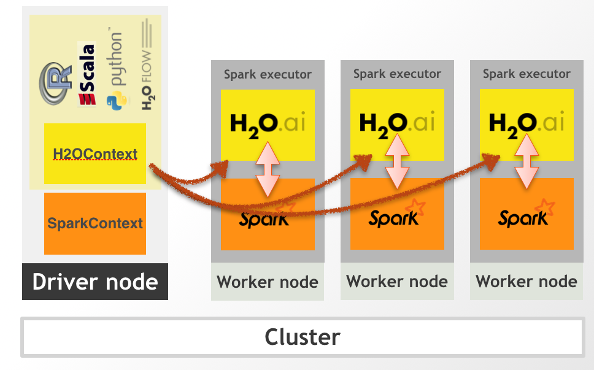
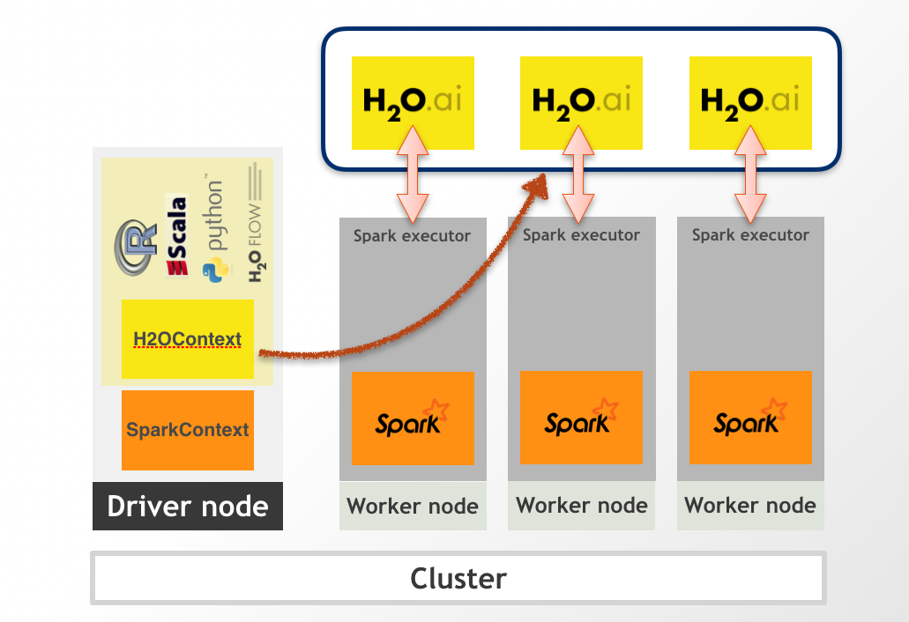

Design
------

Basic Introduction
~~~~~~~~~~~~~~~~~~

Sparkling Water is designed to be executed as a regular Spark
application. It provides a way to initialize H2O services on each node
in the Spark cluster and access data stored in data structures of Spark
and H2O.

Sparkling Water provides transparent integration for the H2O engine
and its machine learning algorithms into the Spark platform, enabling:

- Use of H2O algorithms in Spark workflow.
- Transformation between H2O and Spark data structures.
- Use of Spark RDDs as input for H2O algorithms.
- Transparent execution of Sparkling Water applications on top of Spark.

Sparkling Water supports two type of backends. In the internal backend,
Sparkling Water is launched inside a Spark executor, which is created
after application submission. At this point, H2O starts services,
including distributed KV store and memory manager, and orchestrates them
into a cloud. The topology of the created cloud matches the topology of
the underlying Spark cluster exactly. The following figure represents the Internal
Sparkling Water cluster.

In external backend, the H2O cluster is started separately and we
connect to it from the Spark driver. The following figure represents the External
Sparkling Water cluster.

To read more about the backends, please visit `Sparkling Water
Backends <../tutorials/backends.rst>`__.

When H2O services are running, it is possible to create H2O data
structures, call H2O algorithms, and transfer values from/to RDD.

More Materials
~~~~~~~~~~~~~~

To read more about Sparkling Water design, you can visit on of the links
bellow:

-  `Basic Primitives <basic_primitives.rst>`__
-  `Supported Platforms <supported_platforms.rst>`__
-  `Spark Frame - H2O Frame Mapping <spark_h2o_mapping.rst>`__
-  `Data Sharing Between H2O and Spark <data_sharing.rst>`__
-  `Supported Data Sources <supported_data_sources.rst>`__
-  `Supported Data Formats <supported_data_formats.rst>`__
