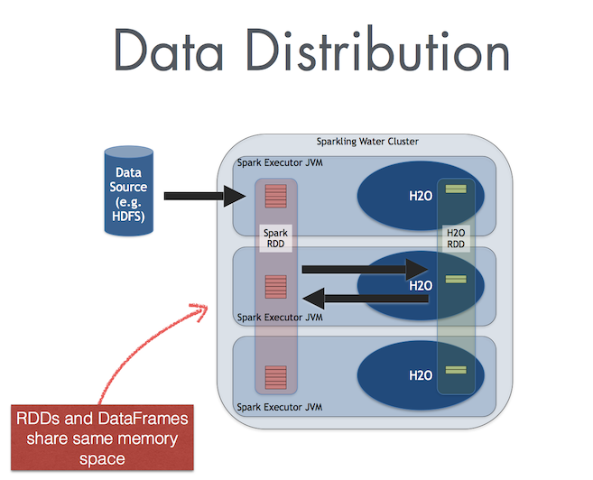

Data Sharing
------------

Sparkling Water enables transformation between different types of Spark's ``RDD`` and H2O's ``H2OFrame``, and vice versa.

Conversion Design
~~~~~~~~~~~~~~~~~

When converting from ``H2OFrame`` to ``RDD``, a wrapper is created around the ``H2OFrame`` to provide an RDD-like API. In this case, no data is duplicated; instead, the data is served directly from the underlying ``H2OFrame``.

Conversion in the opposite direction (i.e, from Spark ``RDD``/``DataFrame`` to ``H2OFrame``) requires evaluation of the data stored in the Spark ``RDD`` and then transferring that from RDD storage into ``H2OFrame``. However, data stored in ``H2OFrame`` is heavily compressed.

Exchanging the Data
~~~~~~~~~~~~~~~~~~~

The way that data is transferred between Spark and H2O differs based on the used Sparkling Water backend. (Refer to :ref:`backend` for more information about the Internal and External backends.)

In the Internal Sparkling Water Backend, Spark and H2O share the same JVM, as is depicted in the following figure.

|Data Sharing|

In the External Sparkling Water Backend, Spark and H2O are separated clusters, and data has to be sent between those clusters over the network.

Memory Consideration When Converting Between Data Frames Types
~~~~~~~~~~~~~~~~~~~~~~~~~~~~~~~~~~~~~~~~~~~~~~~~~~~~~~~~~~~~~~

When Using Sparkling Water External Backend:
^^^^^^^^^^^^^^^^^^^^^^^^^^^^^^^^^^^^^^^^^^^^

If you have allocated the recommended memory amount to your H2O cluster (4 x the size of your dataset),
you don't need to worry about memory constraints when converting between a Spark DataFrame
and an H2OFrame; there is no collision with Spark storage.

Note: the 4 x the size of your dataset assumes your dataset is represented as a CSV.
If your dataset is represented as JSON, XML or parquet, the requirements may differ significantly.

When Using Sparkling Water Internal Backend:
^^^^^^^^^^^^^^^^^^^^^^^^^^^^^^^^^^^^^^^^^^^^

In the internal backend mode, H2O-3 shares the JVM with Spark executors. In this case, you will want to
allocate enough memory to run Spark transformations on your DataFrame (which means allocating a
minimum memory of your dataset and memory for those transformations), plus allocate an additional 4 x the
size of your dataset.

Note: there is data duplication when you convert between a Spark DataFrame and an
H2Oframe (though H2O uses compression tricks to help reduce the memory requirements for this
conversion); there is no data duplication when you convert between an H2OFrame and
a Spark DataFrame because Sparkling Water uses a wrapper around the H2OFrame, which
uses the RDD/DataFrame API.
