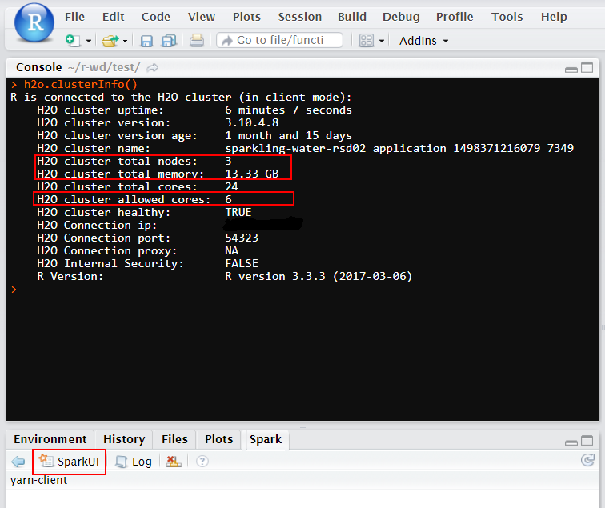
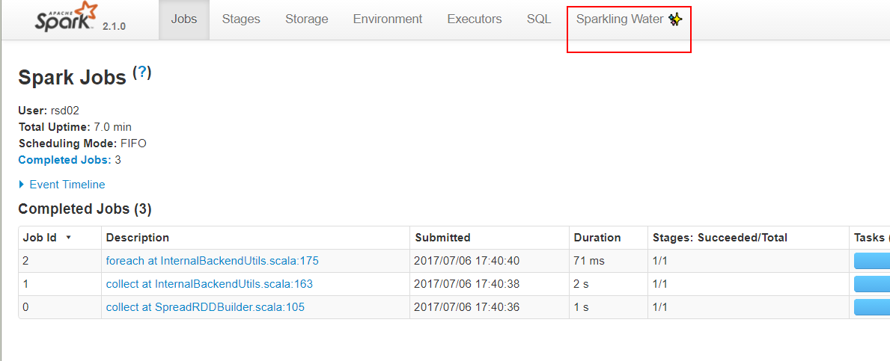
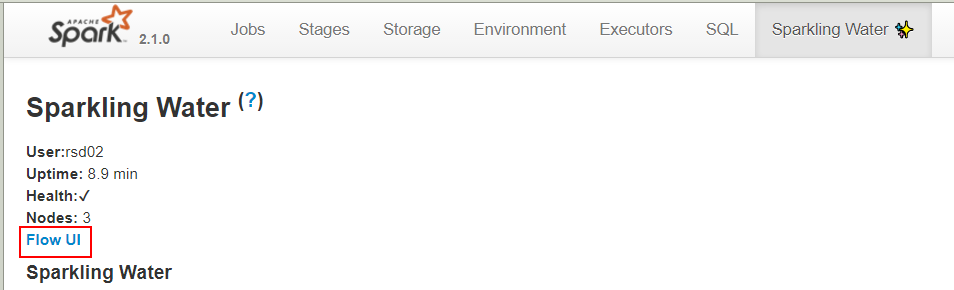
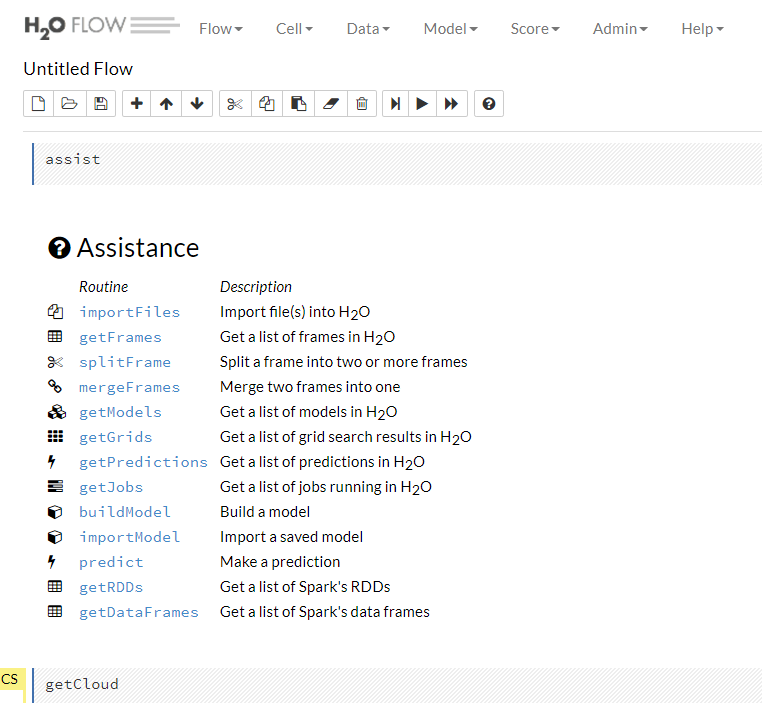
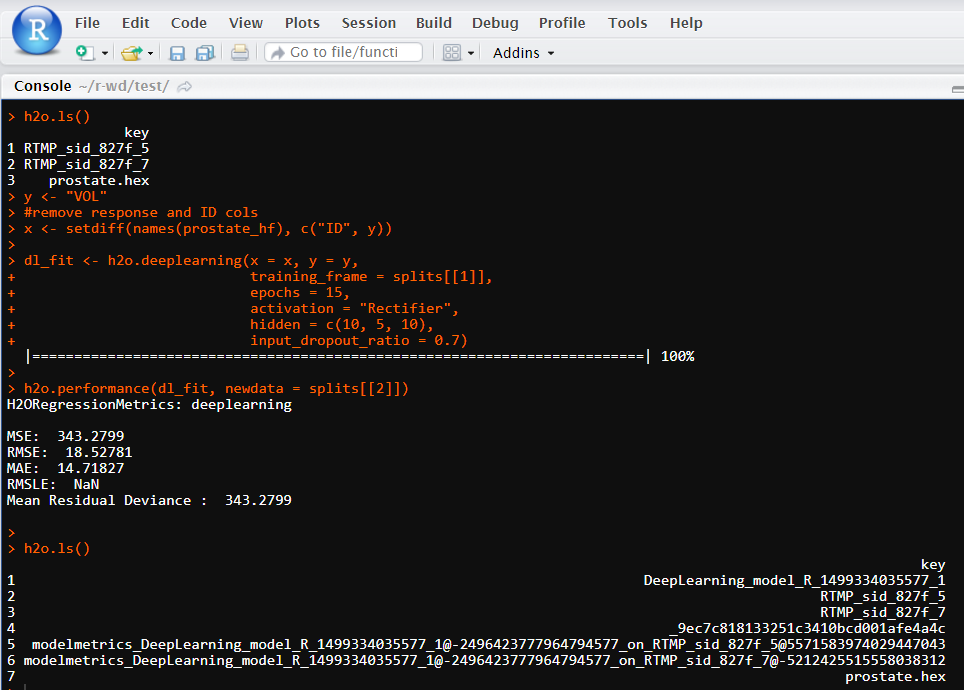

Using sparkling water in YARN mode through sparklyr + rsparkling
================
Bruce Zhao
July 6, 2017

-   [1. Prerequisites](#prerequisites)
-   [2. Connection configurations](#connection-configurations)
-   [3. Read hdfs files](#read-hdfs-files)
-   [4. A deep learning example from rstudio](#a-deep-learning-example-from-rstudio)
-   [5. Disconnect](#disconnect)

## 1. Prerequisites

### 1.1 Hadoop YARN

Point SPARK\_HOME to an existing installation of Spark:

``` shell
export SPARK_HOME='/path/to/spark/installation'
```

Set the HADOOP\_CONF\_DIR and Spark MASTER environmental variables.

``` shell
export HADOOP_CONF_DIR=/etc/hadoop/conf 
export MASTER="yarn-client" 
```

**Generally, these have been done by the Operations Department**

### 1.2 Right version spark + sparkling water + h2o

my versions are:

-   spark 2.1.0 <https://spark.apache.org/downloads.html>
-   sparkling water 2.1.8 <http://h2o-release.s3.amazonaws.com/sparkling-water/rel-2.1/8/index.html>
-   h2o 3.10.4.8 <http://h2o-release.s3.amazonaws.com/h2o/rel-ueno/8/index.html>

### 1.3 Running sparkling water in the backend

``` shell
cd sparkling-water-2.1.8/ 

nohup bin/sparkling-shell --num-executors 3 --executor-memory 5g --master yarn-client > ./test.out &
```

### 1.4 R Packages installed

-   dplyr
-   sparklyr
-   h2o
-   rsparkling

## 2. Connection configurations


`sparklyr.shell.*` will pass parameters to `spark-submit`, please see : <http://spark.rstudio.com/deployment.html#package_options>

The below configurations start a cluster with `15g memory` and `6 cores`.

``` r
Sys.setenv(SPARK_HOME = "/home/Rstudio/spark-2.1.0-bin-hadoop2.7")
options(rsparkling.sparklingwater.version = "2.1.8")
options(rsparkling.sparklingwater.location = "/home/Rstudio/sparkling-water-2.1.8/assembly/build/libs/sparkling-water-assembly_2.11-2.1.8-all.jar")

library(dplyr)
library(sparklyr)
library(h2o)
library(rsparkling)

conf <- list(
  "sparklyr.shell.driver-memory"= "4g",
  "sparklyr.shell.num-executors" = 3,
  "sparklyr.shell.executor-memory" = "5g",
  "sparklyr.shell.executor-cores" = 2
)

# connecting to spark
sc <- spark_connect(master="yarn-client",
                    version = "2.1.0", 
                    spark_home = '/home/Rstudio/spark-2.1.0-bin-hadoop2.7',
                    config = conf)

# connecting to sparkling water
h2o_flow(sc)

# View the status of h2o cloud
h2o.clusterInfo()
h2o.clusterStatus()
```



<hr>
spark-ui:


<hr>
h2o-flow:


<hr>


<hr>

## 3. Read hdfs files

``` r
# you can also use H2o Flow to import data
mydata <- h2o.importFile(path = "hdfs://nameservice1/test/test.txt",destination_frame = "test.hex")

# convert h2o-hex to spark RDD
mydata_tbl <- as_spark_dataframe(sc,mydata)
```

**I recommend use h2o flow `importFiles` to import data, it's pretty much easy**, then you just need `mydata <- h2o.getFrame("data_name_id.hex")`, send the key index to R.

## 4. A deep learning example from rstudio


<http://spark.rstudio.com/h2o.html#deep_learning>

``` r
path <- system.file("extdata", "prostate.csv", package = "h2o")
test <- readr::read_csv(path)

# copy R dataframe to spark RDD
prostate_df <- sdf_copy_to(sc, test, "prostate")
head(prostate_df)

# spark RDD to h2o hex
prostate_hf <- as_h2o_frame(sc, prostate_df, name = "prostate.hex")
splits <- h2o.splitFrame(prostate_hf, seed = 1)

h2o.ls()

y <- "VOL"
#remove response and ID cols
x <- setdiff(names(prostate_hf), c("ID", y))

dl_fit <- h2o.deeplearning(x = x, y = y,
                           training_frame = splits[[1]],
                           epochs = 15,
                           activation = "Rectifier",
                           hidden = c(10, 5, 10),
                           input_dropout_ratio = 0.7)

h2o.performance(dl_fit, newdata = splits[[2]])

h2o.ls()
```

<hr>
h2o-result:


<hr>

## 5. Disconnect


``` r
h2o:::.h2o.garbageCollect()
h2o.shutdown(prompt=FALSE)

spark_disconnect(sc)
```
